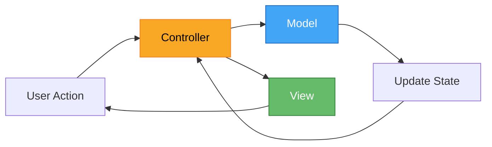
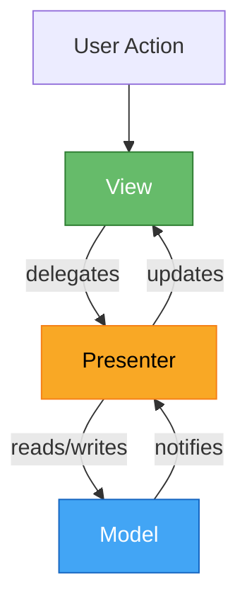
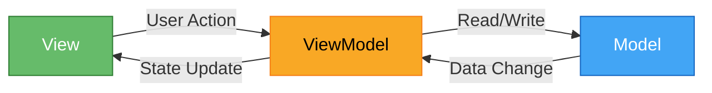
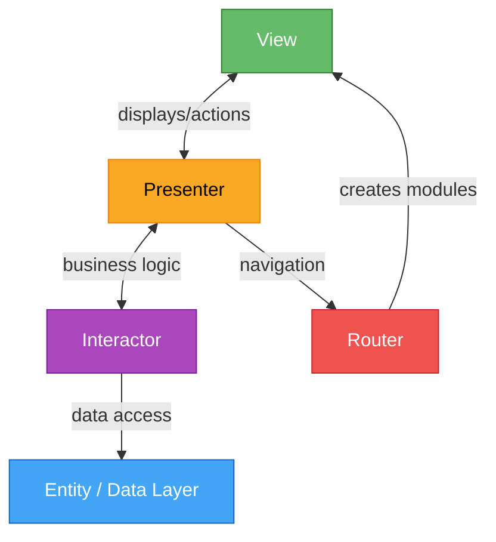
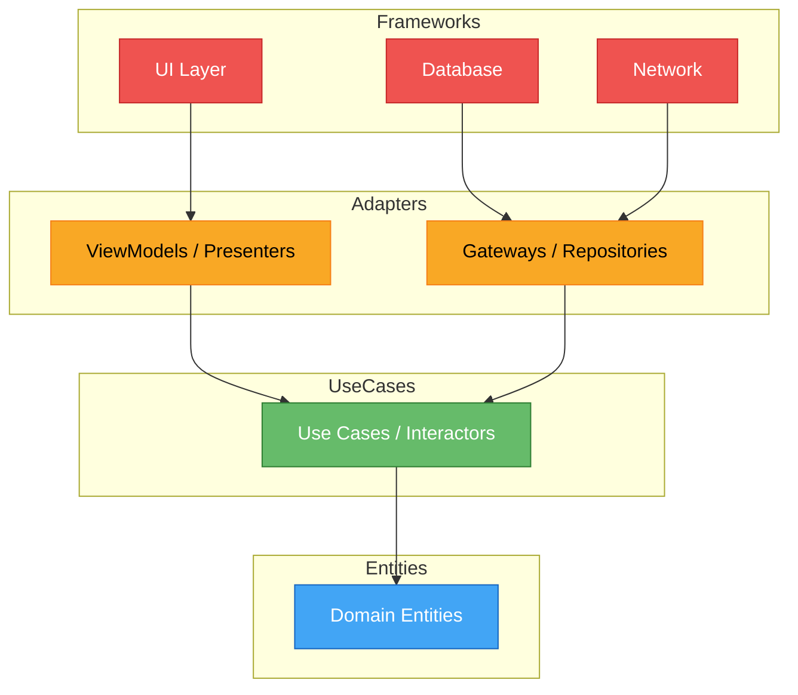

<div align="center">

# 📱 Awesome Mobile Architecture

[](https://awesome.re)
[](https://github.com/muhittincamdali/awesome-mobile-architecture/stargazers)
[](https://github.com/muhittincamdali/awesome-mobile-architecture/network/members)
[](https://github.com/muhittincamdali/awesome-mobile-architecture/blob/main/LICENSE)
[](https://github.com/muhittincamdali/awesome-mobile-architecture/pulls)
[](https://github.com/muhittincamdali/awesome-mobile-architecture/issues)
[](https://github.com/muhittincamdali/awesome-mobile-architecture/graphs/commit-activity)

**The ultimate guide to mobile architecture patterns for iOS, Flutter & React Native**

*A curated collection of architecture patterns, best practices, and production-ready code examples for building scalable mobile applications.*

[Patterns](#-architecture-patterns) · [Examples](./examples) · [Comparison](#-comparison-table) · [Resources](#-resources) · [Contributing](CONTRIBUTING.md)

</div>

---

## 📖 Table of Contents

- [Introduction](#-introduction)
- [Architecture Patterns](#-architecture-patterns)
  - [MVC — Model-View-Controller](#1-mvc--model-view-controller)
  - [MVP — Model-View-Presenter](#2-mvp--model-view-presenter)
  - [MVVM — Model-View-ViewModel](#3-mvvm--model-view-viewmodel)
  - [VIPER](#4-viper)
  - [Clean Architecture](#5-clean-architecture)
  - [TCA — The Composable Architecture](#6-tca--the-composable-architecture)
  - [BLoC — Business Logic Component](#7-bloc--business-logic-component)
  - [Redux](#8-redux)
  - [MVI — Model-View-Intent](#9-mvi--model-view-intent)
  - [Coordinator Pattern](#10-coordinator-pattern)
  - [Repository Pattern](#11-repository-pattern)
  - [CQRS — Command Query Responsibility Segregation](#12-cqrs--command-query-responsibility-segregation)
- [Comparison Table](#-comparison-table)
- [Decision Guide](#-decision-guide)
- [Working Examples](#-working-examples)
- [Resources](#-resources)
- [Contributing](#-contributing)
- [License](#-license)

---

## 🌟 Introduction

Choosing the right architecture pattern is one of the most impactful decisions you'll make on a mobile project. A good architecture:

- **Separates concerns** so each layer can evolve independently
- **Enables testability** by isolating business logic from UI
- **Scales with team size** — multiple developers can work in parallel
- **Reduces technical debt** with clear boundaries and contracts
- **Simplifies onboarding** by giving newcomers a mental model of the codebase

This guide covers **12 battle-tested patterns** with real, production-quality implementations across three platforms: **iOS (Swift)**, **Flutter (Dart)**, and **React Native (TypeScript)**.

Every pattern includes:
- A plain-English explanation of what it is and when to use it
- Pros and cons drawn from real-world experience
- A Mermaid architecture diagram
- Full code examples (50+ lines each) for all three platforms

> **Tip:** If you're new to mobile architecture, start with [MVC](#1-mvc--model-view-controller), then move to [MVVM](#3-mvvm--model-view-viewmodel). Once comfortable, explore [Clean Architecture](#5-clean-architecture) or [VIPER](#4-viper) for larger apps.

---

## 🏗 Architecture Patterns

---

### 1. MVC — Model-View-Controller

**The classic.** MVC is the grandfather of UI architecture patterns. It divides an application into three interconnected components, making it straightforward to understand and quick to implement.

#### When to Use
- Small to medium-sized applications
- Rapid prototyping and MVPs
- Teams new to architecture patterns
- Simple CRUD applications

#### How It Works

The **Model** holds data and business logic. The **View** displays information to the user. The **Controller** acts as the glue — it receives user input from the View, processes it (possibly updating the Model), and updates the View accordingly.



#### Pros
| Advantage | Description |
|-----------|-------------|
| ✅ Simple | Easy to understand, minimal boilerplate |
| ✅ Fast setup | Get a working app in minutes |
| ✅ Well-known | Every developer has encountered MVC |
| ✅ Good docs | Extensive documentation for all platforms |

#### Cons
| Disadvantage | Description |
|--------------|-------------|
| ❌ Massive Controller | Controllers tend to grow into "God objects" |
| ❌ Tight coupling | View and Controller often become intertwined |
| ❌ Hard to test | Business logic mixed with UI logic |
| ❌ Doesn't scale | Becomes unwieldy in large applications |

#### iOS (Swift) Implementation

```swift
import UIKit

// MARK: - Model
struct User: Codable {
    let id: Int
    let name: String
    let email: String
    let avatarURL: String
    
    var displayName: String {
        return name.isEmpty ? "Anonymous" : name
    }
    
    var isValid: Bool {
        return !name.isEmpty && email.contains("@")
    }
}

struct UserList {
    private(set) var users: [User] = []
    
    mutating func add(_ user: User) {
        users.append(user)
    }
    
    mutating func remove(at index: Int) {
        guard users.indices.contains(index) else { return }
        users.remove(at: index)
    }
    
    func user(at index: Int) -> User? {
        guard users.indices.contains(index) else { return nil }
        return users[index]
    }
    
    var count: Int { users.count }
}

// MARK: - Controller
final class UserListViewController: UIViewController {
    
    // MARK: Properties
    private var userList = UserList()
    private let tableView = UITableView()
    private let refreshControl = UIRefreshControl()
    private let activityIndicator = UIActivityIndicatorView(style: .large)
    
    // MARK: Lifecycle
    override func viewDidLoad() {
        super.viewDidLoad()
        setupUI()
        fetchUsers()
    }
    
    // MARK: UI Setup
    private func setupUI() {
        title = "Users"
        view.backgroundColor = .systemBackground
        
        tableView.frame = view.bounds
        tableView.autoresizingMask = [.flexibleWidth, .flexibleHeight]
        tableView.dataSource = self
        tableView.delegate = self
        tableView.register(UITableViewCell.self, forCellReuseIdentifier: "UserCell")
        tableView.refreshControl = refreshControl
        refreshControl.addTarget(self, action: #selector(fetchUsers), for: .valueChanged)
        view.addSubview(tableView)
        
        activityIndicator.center = view.center
        activityIndicator.hidesWhenStopped = true
        view.addSubview(activityIndicator)
        
        navigationItem.rightBarButtonItem = UIBarButtonItem(
            barButtonSystemItem: .add,
            target: self,
            action: #selector(addUserTapped)
        )
    }
    
    // MARK: Data Fetching
    @objc private func fetchUsers() {
        activityIndicator.startAnimating()
        
        let url = URL(string: "https://api.example.com/users")!
        URLSession.shared.dataTask(with: url) { [weak self] data, response, error in
            DispatchQueue.main.async {
                self?.activityIndicator.stopAnimating()
                self?.refreshControl.endRefreshing()
                
                guard let data = data, error == nil else {
                    self?.showError(error?.localizedDescription ?? "Unknown error")
                    return
                }
                
                do {
                    let users = try JSONDecoder().decode([User].self, from: data)
                    users.forEach { self?.userList.add($0) }
                    self?.tableView.reloadData()
                } catch {
                    self?.showError("Failed to parse users")
                }
            }
        }.resume()
    }
    
    // MARK: Actions
    @objc private func addUserTapped() {
        let alert = UIAlertController(title: "Add User", message: nil, preferredStyle: .alert)
        alert.addTextField { $0.placeholder = "Name" }
        alert.addTextField { $0.placeholder = "Email" }
        
        let addAction = UIAlertAction(title: "Add", style: .default) { [weak self] _ in
            guard let name = alert.textFields?[0].text,
                  let email = alert.textFields?[1].text else { return }
            
            let newUser = User(id: Int.random(in: 1000...9999), name: name, email: email, avatarURL: "")
            self?.userList.add(newUser)
            self?.tableView.reloadData()
        }
        
        alert.addAction(addAction)
        alert.addAction(UIAlertAction(title: "Cancel", style: .cancel))
        present(alert, animated: true)
    }
    
    private func showError(_ message: String) {
        let alert = UIAlertController(title: "Error", message: message, preferredStyle: .alert)
        alert.addAction(UIAlertAction(title: "OK", style: .default))
        present(alert, animated: true)
    }
}

// MARK: - UITableViewDataSource & Delegate
extension UserListViewController: UITableViewDataSource, UITableViewDelegate {
    
    func tableView(_ tableView: UITableView, numberOfRowsInSection section: Int) -> Int {
        return userList.count
    }
    
    func tableView(_ tableView: UITableView, cellForRowAt indexPath: IndexPath) -> UITableViewCell {
        let cell = tableView.dequeueReusableCell(withIdentifier: "UserCell", for: indexPath)
        if let user = userList.user(at: indexPath.row) {
            cell.textLabel?.text = user.displayName
            cell.detailTextLabel?.text = user.email
        }
        return cell
    }
    
    func tableView(_ tableView: UITableView, didSelectRowAt indexPath: IndexPath) {
        tableView.deselectRow(at: indexPath, animated: true)
        guard let user = userList.user(at: indexPath.row) else { return }
        
        let detailVC = UserDetailViewController(user: user)
        navigationController?.pushViewController(detailVC, animated: true)
    }
    
    func tableView(_ tableView: UITableView, commit editingStyle: UITableViewCell.EditingStyle,
                    forRowAt indexPath: IndexPath) {
        if editingStyle == .delete {
            userList.remove(at: indexPath.row)
            tableView.deleteRows(at: [indexPath], with: .automatic)
        }
    }
}

// MARK: - Detail View Controller
final class UserDetailViewController: UIViewController {
    
    private let user: User
    
    init(user: User) {
        self.user = user
        super.init(nibName: nil, bundle: nil)
    }
    
    required init?(coder: NSCoder) { fatalError("init(coder:) not supported") }
    
    override func viewDidLoad() {
        super.viewDidLoad()
        title = user.displayName
        view.backgroundColor = .systemBackground
        
        let label = UILabel()
        label.text = "Email: \(user.email)\nID: \(user.id)"
        label.numberOfLines = 0
        label.textAlignment = .center
        label.frame = view.bounds
        label.autoresizingMask = [.flexibleWidth, .flexibleHeight]
        view.addSubview(label)
    }
}
```

#### Flutter (Dart) Implementation

```dart
import 'package:flutter/material.dart';
import 'dart:convert';
import 'package:http/http.dart' as http;

// ──────────────────────────────────────────────
// Model
// ──────────────────────────────────────────────

class User {
  final int id;
  final String name;
  final String email;
  final String avatarUrl;

  const User({
    required this.id,
    required this.name,
    required this.email,
    this.avatarUrl = '',
  });

  factory User.fromJson(Map<String, dynamic> json) {
    return User(
      id: json['id'] as int,
      name: json['name'] as String,
      email: json['email'] as String,
      avatarUrl: json['avatar_url'] as String? ?? '',
    );
  }

  Map<String, dynamic> toJson() => {
        'id': id,
        'name': name,
        'email': email,
        'avatar_url': avatarUrl,
      };

  String get displayName => name.isEmpty ? 'Anonymous' : name;
  bool get isValid => name.isNotEmpty && email.contains('@');
}

class UserListModel {
  final List<User> _users = [];

  List<User> get users => List.unmodifiable(_users);
  int get count => _users.length;

  void add(User user) => _users.add(user);

  void removeAt(int index) {
    if (index >= 0 && index < _users.length) {
      _users.removeAt(index);
    }
  }

  User? userAt(int index) {
    if (index >= 0 && index < _users.length) return _users[index];
    return null;
  }
}

// ──────────────────────────────────────────────
// Controller + View (combined in Flutter MVC)
// ──────────────────────────────────────────────

class UserListPage extends StatefulWidget {
  const UserListPage({super.key});

  @override
  State<UserListPage> createState() => _UserListPageState();
}

class _UserListPageState extends State<UserListPage> {
  final UserListModel _model = UserListModel();
  bool _isLoading = false;
  String? _error;

  @override
  void initState() {
    super.initState();
    _fetchUsers();
  }

  Future<void> _fetchUsers() async {
    setState(() {
      _isLoading = true;
      _error = null;
    });

    try {
      final response =
          await http.get(Uri.parse('https://jsonplaceholder.typicode.com/users'));

      if (response.statusCode == 200) {
        final List<dynamic> data = json.decode(response.body);
        setState(() {
          for (final item in data) {
            _model.add(User.fromJson(item));
          }
          _isLoading = false;
        });
      } else {
        setState(() {
          _error = 'Server returned ${response.statusCode}';
          _isLoading = false;
        });
      }
    } catch (e) {
      setState(() {
        _error = e.toString();
        _isLoading = false;
      });
    }
  }

  void _addUser() {
    final nameController = TextEditingController();
    final emailController = TextEditingController();

    showDialog(
      context: context,
      builder: (ctx) => AlertDialog(
        title: const Text('Add User'),
        content: Column(
          mainAxisSize: MainAxisSize.min,
          children: [
            TextField(
              controller: nameController,
              decoration: const InputDecoration(labelText: 'Name'),
            ),
            TextField(
              controller: emailController,
              decoration: const InputDecoration(labelText: 'Email'),
            ),
          ],
        ),
        actions: [
          TextButton(
            onPressed: () => Navigator.pop(ctx),
            child: const Text('Cancel'),
          ),
          ElevatedButton(
            onPressed: () {
              final user = User(
                id: DateTime.now().millisecondsSinceEpoch,
                name: nameController.text,
                email: emailController.text,
              );
              if (user.isValid) {
                setState(() => _model.add(user));
              }
              Navigator.pop(ctx);
            },
            child: const Text('Add'),
          ),
        ],
      ),
    );
  }

  void _removeUser(int index) {
    setState(() => _model.removeAt(index));
  }

  @override
  Widget build(BuildContext context) {
    return Scaffold(
      appBar: AppBar(
        title: const Text('Users'),
        actions: [
          IconButton(icon: const Icon(Icons.add), onPressed: _addUser),
          IconButton(icon: const Icon(Icons.refresh), onPressed: _fetchUsers),
        ],
      ),
      body: _buildBody(),
    );
  }

  Widget _buildBody() {
    if (_isLoading) {
      return const Center(child: CircularProgressIndicator());
    }
    if (_error != null) {
      return Center(
        child: Column(
          mainAxisAlignment: MainAxisAlignment.center,
          children: [
            Text(_error!, style: const TextStyle(color: Colors.red)),
            const SizedBox(height: 16),
            ElevatedButton(onPressed: _fetchUsers, child: const Text('Retry')),
          ],
        ),
      );
    }
    return RefreshIndicator(
      onRefresh: _fetchUsers,
      child: ListView.builder(
        itemCount: _model.count,
        itemBuilder: (context, index) {
          final user = _model.userAt(index);
          if (user == null) return const SizedBox.shrink();
          return Dismissible(
            key: ValueKey(user.id),
            onDismissed: (_) => _removeUser(index),
            background: Container(color: Colors.red),
            child: ListTile(
              leading: CircleAvatar(child: Text(user.displayName[0])),
              title: Text(user.displayName),
              subtitle: Text(user.email),
              onTap: () => Navigator.push(
                context,
                MaterialPageRoute(
                  builder: (_) => UserDetailPage(user: user),
                ),
              ),
            ),
          );
        },
      ),
    );
  }
}

class UserDetailPage extends StatelessWidget {
  final User user;
  const UserDetailPage({super.key, required this.user});

  @override
  Widget build(BuildContext context) {
    return Scaffold(
      appBar: AppBar(title: Text(user.displayName)),
      body: Padding(
        padding: const EdgeInsets.all(24),
        child: Column(
          crossAxisAlignment: CrossAxisAlignment.start,
          children: [
            Text('Name: ${user.displayName}', style: const TextStyle(fontSize: 20)),
            const SizedBox(height: 8),
            Text('Email: ${user.email}', style: const TextStyle(fontSize: 16)),
            const SizedBox(height: 8),
            Text('ID: ${user.id}', style: const TextStyle(fontSize: 16)),
          ],
        ),
      ),
    );
  }
}
```

#### React Native (TypeScript) Implementation

```typescript
import React, { useState, useEffect, useCallback } from 'react';
import {
  View,
  Text,
  FlatList,
  TouchableOpacity,
  TextInput,
  Alert,
  ActivityIndicator,
  RefreshControl,
  StyleSheet,
} from 'react-native';

// ──────────────────────────────────────────────
// Model
// ──────────────────────────────────────────────

interface User {
  id: number;
  name: string;
  email: string;
  avatarUrl: string;
}

const createUser = (
  id: number,
  name: string,
  email: string,
  avatarUrl: string = ''
): User => ({
  id,
  name,
  email,
  avatarUrl,
});

const getDisplayName = (user: User): string =>
  user.name.trim() === '' ? 'Anonymous' : user.name;

const isValidUser = (user: User): boolean =>
  user.name.trim() !== '' && user.email.includes('@');

// ──────────────────────────────────────────────
// Controller + View (combined in React)
// ──────────────────────────────────────────────

const UserListScreen: React.FC<{ navigation: any }> = ({ navigation }) => {
  const [users, setUsers] = useState<User[]>([]);
  const [loading, setLoading] = useState(false);
  const [error, setError] = useState<string | null>(null);

  const fetchUsers = useCallback(async () => {
    setLoading(true);
    setError(null);
    try {
      const response = await fetch(
        'https://jsonplaceholder.typicode.com/users'
      );
      if (!response.ok) throw new Error(`HTTP ${response.status}`);
      const data: User[] = await response.json();
      setUsers(data);
    } catch (err) {
      setError(err instanceof Error ? err.message : 'Unknown error');
    } finally {
      setLoading(false);
    }
  }, []);

  useEffect(() => {
    fetchUsers();
  }, [fetchUsers]);

  const addUser = () => {
    Alert.prompt('Add User', 'Enter name', (name) => {
      Alert.prompt('Add User', 'Enter email', (email) => {
        const newUser = createUser(Date.now(), name, email);
        if (isValidUser(newUser)) {
          setUsers((prev) => [...prev, newUser]);
        }
      });
    });
  };

  const removeUser = (id: number) => {
    setUsers((prev) => prev.filter((u) => u.id !== id));
  };

  const renderItem = ({ item }: { item: User }) => (
    <TouchableOpacity
      style={styles.row}
      onPress={() => navigation.navigate('UserDetail', { user: item })}
      onLongPress={() => removeUser(item.id)}
    >
      <View style={styles.avatar}>
        <Text style={styles.avatarText}>{getDisplayName(item)[0]}</Text>
      </View>
      <View style={styles.info}>
        <Text style={styles.name}>{getDisplayName(item)}</Text>
        <Text style={styles.email}>{item.email}</Text>
      </View>
    </TouchableOpacity>
  );

  if (loading && users.length === 0) {
    return (
      <View style={styles.center}>
        <ActivityIndicator size="large" />
      </View>
    );
  }

  if (error) {
    return (
      <View style={styles.center}>
        <Text style={styles.errorText}>{error}</Text>
        <TouchableOpacity style={styles.retryBtn} onPress={fetchUsers}>
          <Text style={styles.retryText}>Retry</Text>
        </TouchableOpacity>
      </View>
    );
  }

  return (
    <View style={styles.container}>
      <FlatList
        data={users}
        keyExtractor={(item) => String(item.id)}
        renderItem={renderItem}
        refreshControl={
          <RefreshControl refreshing={loading} onRefresh={fetchUsers} />
        }
      />
      <TouchableOpacity style={styles.fab} onPress={addUser}>
        <Text style={styles.fabText}>+</Text>
      </TouchableOpacity>
    </View>
  );
};

const styles = StyleSheet.create({
  container: { flex: 1, backgroundColor: '#fff' },
  center: { flex: 1, justifyContent: 'center', alignItems: 'center' },
  row: { flexDirection: 'row', padding: 16, borderBottomWidth: 1, borderColor: '#eee' },
  avatar: {
    width: 44, height: 44, borderRadius: 22,
    backgroundColor: '#6200ee', justifyContent: 'center', alignItems: 'center',
  },
  avatarText: { color: '#fff', fontSize: 18, fontWeight: 'bold' },
  info: { marginLeft: 12, justifyContent: 'center' },
  name: { fontSize: 16, fontWeight: '600' },
  email: { fontSize: 13, color: '#666', marginTop: 2 },
  errorText: { color: 'red', fontSize: 16, marginBottom: 12 },
  retryBtn: { padding: 12, backgroundColor: '#6200ee', borderRadius: 8 },
  retryText: { color: '#fff', fontWeight: '600' },
  fab: {
    position: 'absolute', bottom: 24, right: 24, width: 56, height: 56,
    borderRadius: 28, backgroundColor: '#6200ee',
    justifyContent: 'center', alignItems: 'center', elevation: 6,
  },
  fabText: { color: '#fff', fontSize: 28, fontWeight: 'bold' },
});

export default UserListScreen;
```

---

### 2. MVP — Model-View-Presenter

**Testability-first MVC.** MVP addresses the "Massive View Controller" problem by extracting all presentation logic into a dedicated **Presenter** class that communicates with the View through a protocol/interface.

#### When to Use
- Medium-sized applications that need good test coverage
- Teams transitioning from MVC who want better separation
- Projects where unit testing the UI layer is a priority
- Applications with complex form validation or formatting logic

#### How It Works

The **View** is passive — it does nothing but display data and forward user events to the Presenter. The **Presenter** holds all the presentation logic: it fetches data from the Model, formats it, and tells the View exactly what to display. The View and Presenter communicate through a well-defined protocol.



#### Pros
| Advantage | Description |
|-----------|-------------|
| ✅ Testable | Presenter logic can be tested without UI framework |
| ✅ Separation | Clear boundary between View and business logic |
| ✅ Reusable | Presenters can be reused with different Views |
| ✅ Predictable | Data flows in one direction through the Presenter |

#### Cons
| Disadvantage | Description |
|--------------|-------------|
| ❌ Boilerplate | Requires protocol definitions for every View |
| ❌ Presenter bloat | Presenters can grow large in complex screens |
| ❌ 1:1 mapping | Usually one Presenter per View (not sharable) |
| ❌ Manual binding | No reactive updates — you wire everything by hand |

#### iOS (Swift) Implementation

```swift
import UIKit

// MARK: - Model
struct Product: Codable, Equatable {
    let id: Int
    let name: String
    let price: Double
    let description: String
    let imageURL: String
    
    var formattedPrice: String {
        return String(format: "$%.2f", price)
    }
    
    var isOnSale: Bool {
        return price < 10.0
    }
}

// MARK: - View Protocol
protocol ProductListViewProtocol: AnyObject {
    func showLoading()
    func hideLoading()
    func showProducts(_ products: [Product])
    func showError(_ message: String)
    func showEmpty(_ message: String)
    func navigateToDetail(_ product: Product)
}

// MARK: - Presenter Protocol
protocol ProductListPresenterProtocol {
    var numberOfProducts: Int { get }
    func viewDidLoad()
    func refresh()
    func didSelectProduct(at index: Int)
    func didTapDelete(at index: Int)
    func product(at index: Int) -> Product?
}

// MARK: - Service
protocol ProductServiceProtocol {
    func fetchProducts(completion: @escaping (Result<[Product], Error>) -> Void)
    func deleteProduct(id: Int, completion: @escaping (Result<Void, Error>) -> Void)
}

final class ProductService: ProductServiceProtocol {
    func fetchProducts(completion: @escaping (Result<[Product], Error>) -> Void) {
        let url = URL(string: "https://api.example.com/products")!
        URLSession.shared.dataTask(with: url) { data, _, error in
            if let error = error {
                completion(.failure(error))
                return
            }
            guard let data = data else {
                completion(.failure(NSError(domain: "", code: -1, userInfo: [
                    NSLocalizedDescriptionKey: "No data received"
                ])))
                return
            }
            do {
                let products = try JSONDecoder().decode([Product].self, from: data)
                completion(.success(products))
            } catch {
                completion(.failure(error))
            }
        }.resume()
    }
    
    func deleteProduct(id: Int, completion: @escaping (Result<Void, Error>) -> Void) {
        completion(.success(()))
    }
}

// MARK: - Presenter
final class ProductListPresenter: ProductListPresenterProtocol {
    
    private weak var view: ProductListViewProtocol?
    private let service: ProductServiceProtocol
    private var products: [Product] = []
    
    var numberOfProducts: Int { products.count }
    
    init(view: ProductListViewProtocol, service: ProductServiceProtocol = ProductService()) {
        self.view = view
        self.service = service
    }
    
    func viewDidLoad() {
        fetchProducts()
    }
    
    func refresh() {
        fetchProducts()
    }
    
    func didSelectProduct(at index: Int) {
        guard let product = product(at: index) else { return }
        view?.navigateToDetail(product)
    }
    
    func didTapDelete(at index: Int) {
        guard let product = product(at: index) else { return }
        
        service.deleteProduct(id: product.id) { [weak self] result in
            DispatchQueue.main.async {
                switch result {
                case .success:
                    self?.products.remove(at: index)
                    if self?.products.isEmpty == true {
                        self?.view?.showEmpty("No products available")
                    } else {
                        self?.view?.showProducts(self?.products ?? [])
                    }
                case .failure(let error):
                    self?.view?.showError(error.localizedDescription)
                }
            }
        }
    }
    
    func product(at index: Int) -> Product? {
        guard products.indices.contains(index) else { return nil }
        return products[index]
    }
    
    private func fetchProducts() {
        view?.showLoading()
        
        service.fetchProducts { [weak self] result in
            DispatchQueue.main.async {
                self?.view?.hideLoading()
                
                switch result {
                case .success(let products):
                    self?.products = products
                    if products.isEmpty {
                        self?.view?.showEmpty("No products found")
                    } else {
                        self?.view?.showProducts(products)
                    }
                case .failure(let error):
                    self?.view?.showError(error.localizedDescription)
                }
            }
        }
    }
}

// MARK: - View Controller
final class ProductListViewController: UIViewController, ProductListViewProtocol {
    
    private lazy var presenter: ProductListPresenterProtocol = ProductListPresenter(view: self)
    private let tableView = UITableView()
    private let activityIndicator = UIActivityIndicatorView(style: .large)
    private let emptyLabel = UILabel()
    
    override func viewDidLoad() {
        super.viewDidLoad()
        setupUI()
        presenter.viewDidLoad()
    }
    
    private func setupUI() {
        title = "Products"
        view.backgroundColor = .systemBackground
        
        tableView.frame = view.bounds
        tableView.autoresizingMask = [.flexibleWidth, .flexibleHeight]
        tableView.dataSource = self
        tableView.delegate = self
        tableView.register(UITableViewCell.self, forCellReuseIdentifier: "Cell")
        view.addSubview(tableView)
        
        activityIndicator.center = view.center
        view.addSubview(activityIndicator)
        
        emptyLabel.textAlignment = .center
        emptyLabel.textColor = .secondaryLabel
        emptyLabel.isHidden = true
        emptyLabel.frame = view.bounds
        view.addSubview(emptyLabel)
    }
    
    // MARK: ProductListViewProtocol
    func showLoading() { activityIndicator.startAnimating() }
    func hideLoading() { activityIndicator.stopAnimating() }
    
    func showProducts(_ products: [Product]) {
        emptyLabel.isHidden = true
        tableView.isHidden = false
        tableView.reloadData()
    }
    
    func showError(_ message: String) {
        let alert = UIAlertController(title: "Error", message: message, preferredStyle: .alert)
        alert.addAction(UIAlertAction(title: "Retry", style: .default) { [weak self] _ in
            self?.presenter.refresh()
        })
        alert.addAction(UIAlertAction(title: "OK", style: .cancel))
        present(alert, animated: true)
    }
    
    func showEmpty(_ message: String) {
        tableView.isHidden = true
        emptyLabel.text = message
        emptyLabel.isHidden = false
    }
    
    func navigateToDetail(_ product: Product) {
        // Push detail VC
    }
}

extension ProductListViewController: UITableViewDataSource, UITableViewDelegate {
    func tableView(_ tableView: UITableView, numberOfRowsInSection section: Int) -> Int {
        return presenter.numberOfProducts
    }
    
    func tableView(_ tableView: UITableView, cellForRowAt indexPath: IndexPath) -> UITableViewCell {
        let cell = tableView.dequeueReusableCell(withIdentifier: "Cell", for: indexPath)
        if let product = presenter.product(at: indexPath.row) {
            cell.textLabel?.text = product.name
            cell.detailTextLabel?.text = product.formattedPrice
        }
        return cell
    }
    
    func tableView(_ tableView: UITableView, didSelectRowAt indexPath: IndexPath) {
        tableView.deselectRow(at: indexPath, animated: true)
        presenter.didSelectProduct(at: indexPath.row)
    }
}
```

#### Flutter (Dart) Implementation

```dart
import 'package:flutter/material.dart';
import 'dart:convert';
import 'package:http/http.dart' as http;

// ──────────────────────────────────────────────
// Model
// ──────────────────────────────────────────────

class Product {
  final int id;
  final String name;
  final double price;
  final String description;

  const Product({
    required this.id,
    required this.name,
    required this.price,
    this.description = '',
  });

  factory Product.fromJson(Map<String, dynamic> json) {
    return Product(
      id: json['id'] as int,
      name: json['title'] as String? ?? json['name'] as String? ?? '',
      price: (json['price'] as num?)?.toDouble() ?? 0.0,
      description: json['description'] as String? ?? '',
    );
  }

  String get formattedPrice => '\$${price.toStringAsFixed(2)}';
  bool get isOnSale => price < 10.0;
}

// ──────────────────────────────────────────────
// View Contract
// ──────────────────────────────────────────────

abstract class ProductListView {
  void showLoading();
  void hideLoading();
  void showProducts(List<Product> products);
  void showError(String message);
  void showEmpty(String message);
  void navigateToDetail(Product product);
}

// ──────────────────────────────────────────────
// Presenter
// ──────────────────────────────────────────────

class ProductListPresenter {
  final ProductListView _view;
  List<Product> _products = [];

  ProductListPresenter(this._view);

  int get productCount => _products.length;

  Product? productAt(int index) {
    if (index >= 0 && index < _products.length) return _products[index];
    return null;
  }

  Future<void> loadProducts() async {
    _view.showLoading();
    try {
      final response = await http
          .get(Uri.parse('https://jsonplaceholder.typicode.com/posts'));

      if (response.statusCode == 200) {
        final List<dynamic> data = json.decode(response.body);
        _products = data.map((e) => Product.fromJson(e)).toList();
        _view.hideLoading();
        if (_products.isEmpty) {
          _view.showEmpty('No products found');
        } else {
          _view.showProducts(_products);
        }
      } else {
        _view.hideLoading();
        _view.showError('Server error: ${response.statusCode}');
      }
    } catch (e) {
      _view.hideLoading();
      _view.showError(e.toString());
    }
  }

  void onProductSelected(int index) {
    final product = productAt(index);
    if (product != null) {
      _view.navigateToDetail(product);
    }
  }

  void onProductDeleted(int index) {
    if (index >= 0 && index < _products.length) {
      _products.removeAt(index);
      if (_products.isEmpty) {
        _view.showEmpty('No products available');
      } else {
        _view.showProducts(_products);
      }
    }
  }
}

// ──────────────────────────────────────────────
// View Implementation
// ──────────────────────────────────────────────

class ProductListPage extends StatefulWidget {
  const ProductListPage({super.key});

  @override
  State<ProductListPage> createState() => _ProductListPageState();
}

class _ProductListPageState extends State<ProductListPage>
    implements ProductListView {
  late final ProductListPresenter _presenter;
  bool _isLoading = false;
  String? _error;
  String? _emptyMessage;
  List<Product> _displayProducts = [];

  @override
  void initState() {
    super.initState();
    _presenter = ProductListPresenter(this);
    _presenter.loadProducts();
  }

  @override
  void showLoading() => setState(() => _isLoading = true);

  @override
  void hideLoading() => setState(() => _isLoading = false);

  @override
  void showProducts(List<Product> products) {
    setState(() {
      _displayProducts = products;
      _error = null;
      _emptyMessage = null;
    });
  }

  @override
  void showError(String message) => setState(() => _error = message);

  @override
  void showEmpty(String message) => setState(() => _emptyMessage = message);

  @override
  void navigateToDetail(Product product) {
    Navigator.push(
      context,
      MaterialPageRoute(
        builder: (_) => ProductDetailPage(product: product),
      ),
    );
  }

  @override
  Widget build(BuildContext context) {
    return Scaffold(
      appBar: AppBar(title: const Text('Products')),
      body: _buildBody(),
    );
  }

  Widget _buildBody() {
    if (_isLoading) return const Center(child: CircularProgressIndicator());
    if (_error != null) {
      return Center(
        child: Column(
          mainAxisSize: MainAxisSize.min,
          children: [
            Text(_error!, style: const TextStyle(color: Colors.red)),
            const SizedBox(height: 16),
            ElevatedButton(
              onPressed: () => _presenter.loadProducts(),
              child: const Text('Retry'),
            ),
          ],
        ),
      );
    }
    if (_emptyMessage != null) {
      return Center(child: Text(_emptyMessage!));
    }
    return ListView.builder(
      itemCount: _displayProducts.length,
      itemBuilder: (context, index) {
        final product = _displayProducts[index];
        return Dismissible(
          key: ValueKey(product.id),
          onDismissed: (_) => _presenter.onProductDeleted(index),
          child: ListTile(
            title: Text(product.name),
            subtitle: Text(product.formattedPrice),
            trailing: product.isOnSale
                ? const Chip(label: Text('SALE'))
                : null,
            onTap: () => _presenter.onProductSelected(index),
          ),
        );
      },
    );
  }
}

class ProductDetailPage extends StatelessWidget {
  final Product product;
  const ProductDetailPage({super.key, required this.product});

  @override
  Widget build(BuildContext context) {
    return Scaffold(
      appBar: AppBar(title: Text(product.name)),
      body: Padding(
        padding: const EdgeInsets.all(16),
        child: Column(
          crossAxisAlignment: CrossAxisAlignment.start,
          children: [
            Text(product.name, style: Theme.of(context).textTheme.headlineMedium),
            const SizedBox(height: 8),
            Text(product.formattedPrice,
                style: Theme.of(context).textTheme.titleLarge),
            const SizedBox(height: 16),
            Text(product.description),
          ],
        ),
      ),
    );
  }
}
```

#### React Native (TypeScript) Implementation

```typescript
import React, { useState, useEffect, useCallback } from 'react';
import {
  View,
  Text,
  FlatList,
  TouchableOpacity,
  ActivityIndicator,
  RefreshControl,
  StyleSheet,
  Alert,
} from 'react-native';

// ──────────────────────────────────────────────
// Model
// ──────────────────────────────────────────────

interface Product {
  id: number;
  name: string;
  price: number;
  description: string;
}

const formatPrice = (price: number): string => `$${price.toFixed(2)}`;
const isOnSale = (product: Product): boolean => product.price < 10;

// ──────────────────────────────────────────────
// Presenter
// ──────────────────────────────────────────────

interface ProductListViewContract {
  showLoading: () => void;
  hideLoading: () => void;
  showProducts: (products: Product[]) => void;
  showError: (message: string) => void;
  showEmpty: (message: string) => void;
}

class ProductListPresenter {
  private view: ProductListViewContract;
  private products: Product[] = [];

  constructor(view: ProductListViewContract) {
    this.view = view;
  }

  get productCount(): number {
    return this.products.length;
  }

  productAt(index: number): Product | undefined {
    return this.products[index];
  }

  async loadProducts(): Promise<void> {
    this.view.showLoading();
    try {
      const response = await fetch(
        'https://jsonplaceholder.typicode.com/posts'
      );
      if (!response.ok) throw new Error(`HTTP ${response.status}`);
      const data = await response.json();
      this.products = data.map((item: any) => ({
        id: item.id,
        name: item.title,
        price: Math.random() * 50,
        description: item.body,
      }));
      this.view.hideLoading();
      if (this.products.length === 0) {
        this.view.showEmpty('No products found');
      } else {
        this.view.showProducts([...this.products]);
      }
    } catch (err) {
      this.view.hideLoading();
      this.view.showError(
        err instanceof Error ? err.message : 'Unknown error'
      );
    }
  }

  deleteProduct(index: number): Product[] {
    this.products.splice(index, 1);
    return [...this.products];
  }
}

// ──────────────────────────────────────────────
// View
// ──────────────────────────────────────────────

const ProductListScreen: React.FC<{ navigation: any }> = ({ navigation }) => {
  const [products, setProducts] = useState<Product[]>([]);
  const [loading, setLoading] = useState(false);
  const [error, setError] = useState<string | null>(null);
  const [empty, setEmpty] = useState<string | null>(null);

  const viewContract: ProductListViewContract = {
    showLoading: () => setLoading(true),
    hideLoading: () => setLoading(false),
    showProducts: (p) => {
      setProducts(p);
      setError(null);
      setEmpty(null);
    },
    showError: (msg) => setError(msg),
    showEmpty: (msg) => setEmpty(msg),
  };

  const [presenter] = useState(() => new ProductListPresenter(viewContract));

  useEffect(() => {
    presenter.loadProducts();
  }, []);

  const handleDelete = (index: number) => {
    Alert.alert('Delete', 'Remove this product?', [
      { text: 'Cancel', style: 'cancel' },
      {
        text: 'Delete',
        style: 'destructive',
        onPress: () => {
          const updated = presenter.deleteProduct(index);
          setProducts(updated);
        },
      },
    ]);
  };

  const renderItem = ({ item, index }: { item: Product; index: number }) => (
    <TouchableOpacity
      style={styles.row}
      onPress={() => navigation.navigate('ProductDetail', { product: item })}
      onLongPress={() => handleDelete(index)}
    >
      <View style={styles.rowContent}>
        <Text style={styles.name}>{item.name}</Text>
        <Text style={styles.price}>{formatPrice(item.price)}</Text>
      </View>
      {isOnSale(item) && (
        <View style={styles.saleBadge}>
          <Text style={styles.saleText}>SALE</Text>
        </View>
      )}
    </TouchableOpacity>
  );

  if (loading && products.length === 0) {
    return (
      <View style={styles.center}>
        <ActivityIndicator size="large" />
      </View>
    );
  }

  if (error) {
    return (
      <View style={styles.center}>
        <Text style={styles.errorText}>{error}</Text>
        <TouchableOpacity
          style={styles.retryBtn}
          onPress={() => presenter.loadProducts()}
        >
          <Text style={styles.retryText}>Retry</Text>
        </TouchableOpacity>
      </View>
    );
  }

  if (empty) {
    return (
      <View style={styles.center}>
        <Text style={styles.emptyText}>{empty}</Text>
      </View>
    );
  }

  return (
    <FlatList
      data={products}
      keyExtractor={(item) => String(item.id)}
      renderItem={renderItem}
      refreshControl={
        <RefreshControl
          refreshing={loading}
          onRefresh={() => presenter.loadProducts()}
        />
      }
    />
  );
};

const styles = StyleSheet.create({
  center: { flex: 1, justifyContent: 'center', alignItems: 'center' },
  row: { padding: 16, borderBottomWidth: 1, borderColor: '#eee', flexDirection: 'row', alignItems: 'center' },
  rowContent: { flex: 1 },
  name: { fontSize: 16, fontWeight: '600' },
  price: { fontSize: 14, color: '#666', marginTop: 4 },
  saleBadge: { backgroundColor: '#ff5722', paddingHorizontal: 8, paddingVertical: 4, borderRadius: 4 },
  saleText: { color: '#fff', fontSize: 12, fontWeight: 'bold' },
  errorText: { color: 'red', marginBottom: 12 },
  retryBtn: { backgroundColor: '#6200ee', padding: 12, borderRadius: 8 },
  retryText: { color: '#fff', fontWeight: '600' },
  emptyText: { color: '#999', fontSize: 16 },
});

export default ProductListScreen;
```

---

### 3. MVVM — Model-View-ViewModel

**The reactive powerhouse.** MVVM introduces the ViewModel as a layer that transforms Model data into View-ready state using data binding or reactive streams. This is the most popular pattern in modern mobile development.

#### When to Use
- Medium to large applications
- When you need reactive UI updates
- SwiftUI / Jetpack Compose / Flutter projects
- Teams familiar with reactive programming (Combine, RxSwift, Streams)

#### How It Works

The **ViewModel** exposes observable state that the View binds to. When the Model changes, the ViewModel transforms the data and publishes updates. The View reacts automatically — no manual UI refreshing needed.



#### Pros
| Advantage | Description |
|-----------|-------------|
| ✅ Reactive | UI updates automatically when state changes |
| ✅ Testable | ViewModel is pure logic — easily unit tested |
| ✅ SwiftUI native | Perfectly matches SwiftUI's declarative model |
| ✅ Separation | Clean boundary between UI and business logic |

#### Cons
| Disadvantage | Description |
|--------------|-------------|
| ❌ Overengineered for simple screens | Overkill for static content |
| ❌ Memory leaks | Reactive subscriptions can leak if not managed |
| ❌ Debugging | Reactive chains can be hard to trace |
| ❌ Learning curve | Reactive programming is not intuitive for everyone |

#### iOS (Swift) Implementation

```swift
import Foundation
import Combine
import SwiftUI

// MARK: - Model
struct Task: Identifiable, Codable, Equatable {
    let id: UUID
    var title: String
    var description: String
    var isCompleted: Bool
    var priority: Priority
    let createdAt: Date
    
    enum Priority: String, Codable, CaseIterable {
        case low, medium, high
        
        var displayName: String {
            rawValue.capitalized
        }
        
        var color: String {
            switch self {
            case .low: return "green"
            case .medium: return "orange"
            case .high: return "red"
            }
        }
    }
    
    init(
        id: UUID = UUID(),
        title: String,
        description: String = "",
        isCompleted: Bool = false,
        priority: Priority = .medium,
        createdAt: Date = Date()
    ) {
        self.id = id
        self.title = title
        self.description = description
        self.isCompleted = isCompleted
        self.priority = priority
        self.createdAt = createdAt
    }
}

// MARK: - Service Protocol
protocol TaskServiceProtocol {
    func fetchTasks() async throws -> [Task]
    func createTask(_ task: Task) async throws -> Task
    func updateTask(_ task: Task) async throws -> Task
    func deleteTask(id: UUID) async throws
}

// MARK: - Mock Service
final class TaskService: TaskServiceProtocol {
    private var tasks: [Task] = [
        Task(title: "Design UI Mockups", description: "Create wireframes for new feature", priority: .high),
        Task(title: "Write Unit Tests", description: "Cover ViewModel with tests", priority: .medium),
        Task(title: "Update Readme", description: "Add architecture diagram", priority: .low),
    ]
    
    func fetchTasks() async throws -> [Task] {
        try await withCheckedThrowingContinuation { continuation in
            DispatchQueue.global().asyncAfter(deadline: .now() + 0.5) { [self] in
                continuation.resume(returning: tasks)
            }
        }
    }
    
    func createTask(_ task: Task) async throws -> Task {
        tasks.append(task)
        return task
    }
    
    func updateTask(_ task: Task) async throws -> Task {
        if let index = tasks.firstIndex(where: { $0.id == task.id }) {
            tasks[index] = task
        }
        return task
    }
    
    func deleteTask(id: UUID) async throws {
        tasks.removeAll { $0.id == id }
    }
}

// MARK: - ViewModel
@MainActor
final class TaskListViewModel: ObservableObject {
    
    // Published state
    @Published private(set) var tasks: [Task] = []
    @Published private(set) var isLoading = false
    @Published private(set) var errorMessage: String?
    @Published var searchText = ""
    @Published var filterPriority: Task.Priority?
    @Published var showCompletedOnly = false
    
    // Computed properties
    var filteredTasks: [Task] {
        var result = tasks
        
        if !searchText.isEmpty {
            result = result.filter {
                $0.title.localizedCaseInsensitiveContains(searchText) ||
                $0.description.localizedCaseInsensitiveContains(searchText)
            }
        }
        
        if let priority = filterPriority {
            result = result.filter { $0.priority == priority }
        }
        
        if showCompletedOnly {
            result = result.filter { $0.isCompleted }
        }
        
        return result
    }
    
    var completedCount: Int {
        tasks.filter(\.isCompleted).count
    }
    
    var progressPercentage: Double {
        guard !tasks.isEmpty else { return 0 }
        return Double(completedCount) / Double(tasks.count)
    }
    
    // Dependencies
    private let service: TaskServiceProtocol
    private var cancellables = Set<AnyCancellable>()
    
    init(service: TaskServiceProtocol = TaskService()) {
        self.service = service
    }
    
    // MARK: - Actions
    
    func loadTasks() async {
        isLoading = true
        errorMessage = nil
        
        do {
            tasks = try await service.fetchTasks()
        } catch {
            errorMessage = error.localizedDescription
        }
        
        isLoading = false
    }
    
    func addTask(title: String, description: String, priority: Task.Priority) async {
        let task = Task(title: title, description: description, priority: priority)
        
        do {
            let created = try await service.createTask(task)
            tasks.append(created)
        } catch {
            errorMessage = error.localizedDescription
        }
    }
    
    func toggleCompletion(for task: Task) async {
        var updated = task
        updated.isCompleted.toggle()
        
        do {
            let result = try await service.updateTask(updated)
            if let index = tasks.firstIndex(where: { $0.id == result.id }) {
                tasks[index] = result
            }
        } catch {
            errorMessage = error.localizedDescription
        }
    }
    
    func deleteTask(_ task: Task) async {
        do {
            try await service.deleteTask(id: task.id)
            tasks.removeAll { $0.id == task.id }
        } catch {
            errorMessage = error.localizedDescription
        }
    }
    
    func clearError() {
        errorMessage = nil
    }
}

// MARK: - SwiftUI View
struct TaskListView: View {
    @StateObject private var viewModel = TaskListViewModel()
    @State private var showAddSheet = false
    
    var body: some View {
        NavigationStack {
            VStack(spacing: 0) {
                progressBar
                
                if viewModel.isLoading {
                    ProgressView("Loading tasks...")
                        .frame(maxWidth: .infinity, maxHeight: .infinity)
                } else if viewModel.filteredTasks.isEmpty {
                    emptyState
                } else {
                    taskList
                }
            }
            .navigationTitle("Tasks")
            .searchable(text: $viewModel.searchText, prompt: "Search tasks")
            .toolbar {
                ToolbarItem(placement: .primaryAction) {
                    Button { showAddSheet = true } label: {
                        Image(systemName: "plus")
                    }
                }
            }
            .sheet(isPresented: $showAddSheet) {
                AddTaskSheet(viewModel: viewModel)
            }
            .alert("Error", isPresented: .init(
                get: { viewModel.errorMessage != nil },
                set: { if !$0 { viewModel.clearError() } }
            )) {
                Button("OK") { viewModel.clearError() }
            } message: {
                Text(viewModel.errorMessage ?? "")
            }
            .task {
                await viewModel.loadTasks()
            }
        }
    }
    
    private var progressBar: some View {
        VStack(spacing: 4) {
            ProgressView(value: viewModel.progressPercentage)
                .tint(.green)
            Text("\(viewModel.completedCount)/\(viewModel.tasks.count) completed")
                .font(.caption)
                .foregroundStyle(.secondary)
        }
        .padding()
    }
    
    private var emptyState: some View {
        VStack(spacing: 12) {
            Image(systemName: "checklist")
                .font(.system(size: 48))
                .foregroundStyle(.secondary)
            Text("No tasks found")
                .font(.headline)
            Text("Tap + to add your first task")
                .font(.subheadline)
                .foregroundStyle(.secondary)
        }
        .frame(maxHeight: .infinity)
    }
    
    private var taskList: some View {
        List {
            ForEach(viewModel.filteredTasks) { task in
                TaskRow(task: task) {
                    Task { await viewModel.toggleCompletion(for: task) }
                }
            }
            .onDelete { indexSet in
                for index in indexSet {
                    let task = viewModel.filteredTasks[index]
                    Task { await viewModel.deleteTask(task) }
                }
            }
        }
        .refreshable {
            await viewModel.loadTasks()
        }
    }
}

struct TaskRow: View {
    let task: Task
    let onToggle: () -> Void
    
    var body: some View {
        HStack {
            Button(action: onToggle) {
                Image(systemName: task.isCompleted ? "checkmark.circle.fill" : "circle")
                    .foregroundStyle(task.isCompleted ? .green : .gray)
            }
            .buttonStyle(.plain)
            
            VStack(alignment: .leading, spacing: 4) {
                Text(task.title)
                    .strikethrough(task.isCompleted)
                    .foregroundStyle(task.isCompleted ? .secondary : .primary)
                if !task.description.isEmpty {
                    Text(task.description)
                        .font(.caption)
                        .foregroundStyle(.secondary)
                        .lineLimit(1)
                }
            }
            
            Spacer()
            
            Text(task.priority.displayName)
                .font(.caption2)
                .padding(.horizontal, 8)
                .padding(.vertical, 4)
                .background(priorityColor(task.priority).opacity(0.2))
                .clipShape(Capsule())
        }
    }
    
    private func priorityColor(_ priority: Task.Priority) -> Color {
        switch priority {
        case .low: return .green
        case .medium: return .orange
        case .high: return .red
        }
    }
}

struct AddTaskSheet: View {
    @ObservedObject var viewModel: TaskListViewModel
    @Environment(\.dismiss) private var dismiss
    @State private var title = ""
    @State private var description = ""
    @State private var priority: Task.Priority = .medium
    
    var body: some View {
        NavigationStack {
            Form {
                TextField("Title", text: $title)
                TextField("Description", text: $description)
                Picker("Priority", selection: $priority) {
                    ForEach(Task.Priority.allCases, id: \.self) { p in
                        Text(p.displayName).tag(p)
                    }
                }
            }
            .navigationTitle("New Task")
            .toolbar {
                ToolbarItem(placement: .cancellationAction) {
                    Button("Cancel") { dismiss() }
                }
                ToolbarItem(placement: .confirmationAction) {
                    Button("Add") {
                        Task {
                            await viewModel.addTask(
                                title: title,
                                description: description,
                                priority: priority
                            )
                            dismiss()
                        }
                    }
                    .disabled(title.isEmpty)
                }
            }
        }
    }
}
```

#### Flutter (Dart) Implementation

```dart
import 'package:flutter/material.dart';
import 'dart:async';

// ──────────────────────────────────────────────
// Model
// ──────────────────────────────────────────────

enum TaskPriority { low, medium, high }

extension TaskPriorityX on TaskPriority {
  String get displayName => name[0].toUpperCase() + name.substring(1);
  Color get color {
    switch (this) {
      case TaskPriority.low:
        return Colors.green;
      case TaskPriority.medium:
        return Colors.orange;
      case TaskPriority.high:
        return Colors.red;
    }
  }
}

class TaskItem {
  final String id;
  String title;
  String description;
  bool isCompleted;
  TaskPriority priority;
  final DateTime createdAt;

  TaskItem({
    String? id,
    required this.title,
    this.description = '',
    this.isCompleted = false,
    this.priority = TaskPriority.medium,
    DateTime? createdAt,
  })  : id = id ?? DateTime.now().millisecondsSinceEpoch.toString(),
        createdAt = createdAt ?? DateTime.now();

  TaskItem copyWith({
    String? title,
    String? description,
    bool? isCompleted,
    TaskPriority? priority,
  }) {
    return TaskItem(
      id: id,
      title: title ?? this.title,
      description: description ?? this.description,
      isCompleted: isCompleted ?? this.isCompleted,
      priority: priority ?? this.priority,
      createdAt: createdAt,
    );
  }
}

// ──────────────────────────────────────────────
// ViewModel
// ──────────────────────────────────────────────

class TaskListViewModel extends ChangeNotifier {
  List<TaskItem> _tasks = [];
  bool _isLoading = false;
  String? _errorMessage;
  String _searchQuery = '';
  TaskPriority? _filterPriority;

  // Getters
  bool get isLoading => _isLoading;
  String? get errorMessage => _errorMessage;
  String get searchQuery => _searchQuery;
  TaskPriority? get filterPriority => _filterPriority;

  List<TaskItem> get tasks {
    var result = List<TaskItem>.from(_tasks);
    if (_searchQuery.isNotEmpty) {
      result = result
          .where((t) =>
              t.title.toLowerCase().contains(_searchQuery.toLowerCase()) ||
              t.description.toLowerCase().contains(_searchQuery.toLowerCase()))
          .toList();
    }
    if (_filterPriority != null) {
      result = result.where((t) => t.priority == _filterPriority).toList();
    }
    return result;
  }

  int get completedCount => _tasks.where((t) => t.isCompleted).length;
  int get totalCount => _tasks.length;
  double get progressPercentage =>
      _tasks.isEmpty ? 0 : completedCount / totalCount;

  // Actions
  Future<void> loadTasks() async {
    _isLoading = true;
    _errorMessage = null;
    notifyListeners();

    try {
      await Future.delayed(const Duration(milliseconds: 500));
      _tasks = [
        TaskItem(title: 'Design Mockups', description: 'Create wireframes', priority: TaskPriority.high),
        TaskItem(title: 'Write Tests', description: 'Cover ViewModel', priority: TaskPriority.medium),
        TaskItem(title: 'Update Docs', description: 'Add diagrams', priority: TaskPriority.low),
      ];
    } catch (e) {
      _errorMessage = e.toString();
    }

    _isLoading = false;
    notifyListeners();
  }

  void addTask(String title, String description, TaskPriority priority) {
    _tasks.add(TaskItem(
      title: title,
      description: description,
      priority: priority,
    ));
    notifyListeners();
  }

  void toggleCompletion(String id) {
    final index = _tasks.indexWhere((t) => t.id == id);
    if (index != -1) {
      _tasks[index] = _tasks[index].copyWith(
        isCompleted: !_tasks[index].isCompleted,
      );
      notifyListeners();
    }
  }

  void deleteTask(String id) {
    _tasks.removeWhere((t) => t.id == id);
    notifyListeners();
  }

  void setSearchQuery(String query) {
    _searchQuery = query;
    notifyListeners();
  }

  void setFilterPriority(TaskPriority? priority) {
    _filterPriority = priority;
    notifyListeners();
  }

  void clearError() {
    _errorMessage = null;
    notifyListeners();
  }
}

// ──────────────────────────────────────────────
// View
// ──────────────────────────────────────────────

class TaskListPage extends StatefulWidget {
  const TaskListPage({super.key});

  @override
  State<TaskListPage> createState() => _TaskListPageState();
}

class _TaskListPageState extends State<TaskListPage> {
  late final TaskListViewModel _viewModel;

  @override
  void initState() {
    super.initState();
    _viewModel = TaskListViewModel();
    _viewModel.loadTasks();
  }

  @override
  void dispose() {
    _viewModel.dispose();
    super.dispose();
  }

  @override
  Widget build(BuildContext context) {
    return ListenableBuilder(
      listenable: _viewModel,
      builder: (context, _) {
        return Scaffold(
          appBar: AppBar(
            title: const Text('Tasks'),
            actions: [
              IconButton(
                icon: const Icon(Icons.add),
                onPressed: () => _showAddDialog(context),
              ),
            ],
            bottom: PreferredSize(
              preferredSize: const Size.fromHeight(48),
              child: Padding(
                padding: const EdgeInsets.symmetric(horizontal: 16, vertical: 8),
                child: TextField(
                  decoration: const InputDecoration(
                    hintText: 'Search tasks...',
                    prefixIcon: Icon(Icons.search),
                    isDense: true,
                    border: OutlineInputBorder(),
                  ),
                  onChanged: _viewModel.setSearchQuery,
                ),
              ),
            ),
          ),
          body: Column(
            children: [
              _buildProgressBar(),
              Expanded(child: _buildBody()),
            ],
          ),
        );
      },
    );
  }

  Widget _buildProgressBar() {
    return Padding(
      padding: const EdgeInsets.all(16),
      child: Column(
        children: [
          LinearProgressIndicator(value: _viewModel.progressPercentage),
          const SizedBox(height: 4),
          Text(
            '${_viewModel.completedCount}/${_viewModel.totalCount} completed',
            style: Theme.of(context).textTheme.bodySmall,
          ),
        ],
      ),
    );
  }

  Widget _buildBody() {
    if (_viewModel.isLoading) {
      return const Center(child: CircularProgressIndicator());
    }
    if (_viewModel.errorMessage != null) {
      return Center(child: Text(_viewModel.errorMessage!));
    }
    final tasks = _viewModel.tasks;
    if (tasks.isEmpty) {
      return const Center(child: Text('No tasks found'));
    }
    return RefreshIndicator(
      onRefresh: _viewModel.loadTasks,
      child: ListView.builder(
        itemCount: tasks.length,
        itemBuilder: (context, index) {
          final task = tasks[index];
          return Dismissible(
            key: ValueKey(task.id),
            onDismissed: (_) => _viewModel.deleteTask(task.id),
            background: Container(
              color: Colors.red,
              alignment: Alignment.centerRight,
              padding: const EdgeInsets.only(right: 16),
              child: const Icon(Icons.delete, color: Colors.white),
            ),
            child: ListTile(
              leading: IconButton(
                icon: Icon(
                  task.isCompleted
                      ? Icons.check_circle
                      : Icons.radio_button_unchecked,
                  color: task.isCompleted ? Colors.green : Colors.grey,
                ),
                onPressed: () => _viewModel.toggleCompletion(task.id),
              ),
              title: Text(
                task.title,
                style: TextStyle(
                  decoration:
                      task.isCompleted ? TextDecoration.lineThrough : null,
                ),
              ),
              subtitle: Text(task.description),
              trailing: Chip(
                label: Text(task.priority.displayName),
                backgroundColor: task.priority.color.withOpacity(0.2),
              ),
            ),
          );
        },
      ),
    );
  }

  void _showAddDialog(BuildContext context) {
    final titleCtrl = TextEditingController();
    final descCtrl = TextEditingController();
    var priority = TaskPriority.medium;

    showDialog(
      context: context,
      builder: (ctx) => AlertDialog(
        title: const Text('New Task'),
        content: Column(
          mainAxisSize: MainAxisSize.min,
          children: [
            TextField(controller: titleCtrl, decoration: const InputDecoration(labelText: 'Title')),
            TextField(controller: descCtrl, decoration: const InputDecoration(labelText: 'Description')),
          ],
        ),
        actions: [
          TextButton(onPressed: () => Navigator.pop(ctx), child: const Text('Cancel')),
          ElevatedButton(
            onPressed: () {
              if (titleCtrl.text.isNotEmpty) {
                _viewModel.addTask(titleCtrl.text, descCtrl.text, priority);
              }
              Navigator.pop(ctx);
            },
            child: const Text('Add'),
          ),
        ],
      ),
    );
  }
}
```

#### React Native (TypeScript) Implementation

```typescript
import React, { useState, useEffect, useMemo, useCallback } from 'react';
import {
  View,
  Text,
  FlatList,
  TouchableOpacity,
  TextInput,
  ActivityIndicator,
  RefreshControl,
  Alert,
  StyleSheet,
} from 'react-native';

// ──────────────────────────────────────────────
// Model
// ──────────────────────────────────────────────

type Priority = 'low' | 'medium' | 'high';

interface TaskItem {
  id: string;
  title: string;
  description: string;
  isCompleted: boolean;
  priority: Priority;
  createdAt: number;
}

const priorityColors: Record<Priority, string> = {
  low: '#4caf50',
  medium: '#ff9800',
  high: '#f44336',
};

// ──────────────────────────────────────────────
// ViewModel (custom hook)
// ──────────────────────────────────────────────

const useTaskListViewModel = () => {
  const [tasks, setTasks] = useState<TaskItem[]>([]);
  const [loading, setLoading] = useState(false);
  const [error, setError] = useState<string | null>(null);
  const [searchQuery, setSearchQuery] = useState('');
  const [filterPriority, setFilterPriority] = useState<Priority | null>(null);

  const filteredTasks = useMemo(() => {
    let result = tasks;
    if (searchQuery) {
      const q = searchQuery.toLowerCase();
      result = result.filter(
        (t) =>
          t.title.toLowerCase().includes(q) ||
          t.description.toLowerCase().includes(q)
      );
    }
    if (filterPriority) {
      result = result.filter((t) => t.priority === filterPriority);
    }
    return result;
  }, [tasks, searchQuery, filterPriority]);

  const completedCount = useMemo(
    () => tasks.filter((t) => t.isCompleted).length,
    [tasks]
  );

  const progressPercentage = useMemo(
    () => (tasks.length === 0 ? 0 : completedCount / tasks.length),
    [tasks, completedCount]
  );

  const loadTasks = useCallback(async () => {
    setLoading(true);
    setError(null);
    try {
      await new Promise((resolve) => setTimeout(resolve, 500));
      setTasks([
        {
          id: '1', title: 'Design Mockups', description: 'Create wireframes',
          isCompleted: false, priority: 'high', createdAt: Date.now(),
        },
        {
          id: '2', title: 'Write Tests', description: 'Cover ViewModel',
          isCompleted: false, priority: 'medium', createdAt: Date.now(),
        },
        {
          id: '3', title: 'Update Docs', description: 'Add diagrams',
          isCompleted: true, priority: 'low', createdAt: Date.now(),
        },
      ]);
    } catch (err) {
      setError(err instanceof Error ? err.message : 'Unknown error');
    } finally {
      setLoading(false);
    }
  }, []);

  const addTask = useCallback(
    (title: string, description: string, priority: Priority) => {
      const task: TaskItem = {
        id: String(Date.now()),
        title,
        description,
        isCompleted: false,
        priority,
        createdAt: Date.now(),
      };
      setTasks((prev) => [...prev, task]);
    },
    []
  );

  const toggleCompletion = useCallback((id: string) => {
    setTasks((prev) =>
      prev.map((t) =>
        t.id === id ? { ...t, isCompleted: !t.isCompleted } : t
      )
    );
  }, []);

  const deleteTask = useCallback((id: string) => {
    setTasks((prev) => prev.filter((t) => t.id !== id));
  }, []);

  return {
    tasks: filteredTasks,
    allTasks: tasks,
    loading,
    error,
    searchQuery,
    filterPriority,
    completedCount,
    progressPercentage,
    loadTasks,
    addTask,
    toggleCompletion,
    deleteTask,
    setSearchQuery,
    setFilterPriority,
    clearError: () => setError(null),
  };
};

// ──────────────────────────────────────────────
// View
// ──────────────────────────────────────────────

const TaskListScreen: React.FC = () => {
  const vm = useTaskListViewModel();

  useEffect(() => {
    vm.loadTasks();
  }, []);

  const handleAdd = () => {
    Alert.prompt('New Task', 'Enter title', (title) => {
      if (title) {
        vm.addTask(title, '', 'medium');
      }
    });
  };

  const renderItem = ({ item }: { item: TaskItem }) => (
    <TouchableOpacity
      style={styles.row}
      onPress={() => vm.toggleCompletion(item.id)}
      onLongPress={() =>
        Alert.alert('Delete?', 'Remove this task?', [
          { text: 'Cancel', style: 'cancel' },
          { text: 'Delete', onPress: () => vm.deleteTask(item.id), style: 'destructive' },
        ])
      }
    >
      <View
        style={[
          styles.checkCircle,
          item.isCompleted && styles.checkCircleCompleted,
        ]}
      >
        {item.isCompleted && <Text style={styles.checkMark}>✓</Text>}
      </View>
      <View style={styles.taskInfo}>
        <Text
          style={[
            styles.taskTitle,
            item.isCompleted && styles.taskTitleCompleted,
          ]}
        >
          {item.title}
        </Text>
        {item.description ? (
          <Text style={styles.taskDesc}>{item.description}</Text>
        ) : null}
      </View>
      <View
        style={[
          styles.priorityBadge,
          { backgroundColor: priorityColors[item.priority] + '33' },
        ]}
      >
        <Text
          style={[
            styles.priorityText,
            { color: priorityColors[item.priority] },
          ]}
        >
          {item.priority.toUpperCase()}
        </Text>
      </View>
    </TouchableOpacity>
  );

  return (
    <View style={styles.container}>
      <TextInput
        style={styles.searchInput}
        placeholder="Search tasks..."
        value={vm.searchQuery}
        onChangeText={vm.setSearchQuery}
      />
      <View style={styles.progressContainer}>
        <View style={styles.progressBg}>
          <View
            style={[
              styles.progressFill,
              { width: `${vm.progressPercentage * 100}%` },
            ]}
          />
        </View>
        <Text style={styles.progressText}>
          {vm.completedCount}/{vm.allTasks.length} completed
        </Text>
      </View>
      {vm.loading ? (
        <ActivityIndicator style={styles.center} size="large" />
      ) : vm.error ? (
        <View style={styles.center}>
          <Text style={styles.errorText}>{vm.error}</Text>
        </View>
      ) : (
        <FlatList
          data={vm.tasks}
          keyExtractor={(item) => item.id}
          renderItem={renderItem}
          refreshControl={
            <RefreshControl refreshing={vm.loading} onRefresh={vm.loadTasks} />
          }
        />
      )}
      <TouchableOpacity style={styles.fab} onPress={handleAdd}>
        <Text style={styles.fabText}>+</Text>
      </TouchableOpacity>
    </View>
  );
};

const styles = StyleSheet.create({
  container: { flex: 1, backgroundColor: '#fff' },
  center: { flex: 1, justifyContent: 'center', alignItems: 'center' },
  searchInput: {
    margin: 16, padding: 12, borderWidth: 1, borderColor: '#ddd',
    borderRadius: 8, fontSize: 16,
  },
  progressContainer: { paddingHorizontal: 16, marginBottom: 8 },
  progressBg: { height: 4, backgroundColor: '#e0e0e0', borderRadius: 2 },
  progressFill: { height: 4, backgroundColor: '#4caf50', borderRadius: 2 },
  progressText: { fontSize: 12, color: '#999', marginTop: 4, textAlign: 'center' },
  row: { flexDirection: 'row', padding: 16, borderBottomWidth: 1, borderColor: '#f0f0f0', alignItems: 'center' },
  checkCircle: { width: 28, height: 28, borderRadius: 14, borderWidth: 2, borderColor: '#ccc', justifyContent: 'center', alignItems: 'center' },
  checkCircleCompleted: { backgroundColor: '#4caf50', borderColor: '#4caf50' },
  checkMark: { color: '#fff', fontWeight: 'bold', fontSize: 14 },
  taskInfo: { flex: 1, marginLeft: 12 },
  taskTitle: { fontSize: 16, fontWeight: '600' },
  taskTitleCompleted: { textDecorationLine: 'line-through', color: '#999' },
  taskDesc: { fontSize: 13, color: '#666', marginTop: 2 },
  priorityBadge: { paddingHorizontal: 8, paddingVertical: 4, borderRadius: 12 },
  priorityText: { fontSize: 10, fontWeight: 'bold' },
  errorText: { color: 'red' },
  fab: {
    position: 'absolute', bottom: 24, right: 24, width: 56, height: 56,
    borderRadius: 28, backgroundColor: '#6200ee',
    justifyContent: 'center', alignItems: 'center', elevation: 6,
  },
  fabText: { color: '#fff', fontSize: 28 },
});

export default TaskListScreen;
```

---

### 4. VIPER

**Enterprise-grade modularization.** VIPER splits every screen into five distinct layers: **V**iew, **I**nteractor, **P**resenter, **E**ntity, and **R**outer. This is the most granular architecture pattern, designed for large teams working on complex applications.

#### When to Use
- Large applications with many screens and features
- Teams with 5+ developers per module
- Projects requiring strict separation of concerns
- Applications with complex navigation flows
- When you want maximum testability

#### How It Works

Each VIPER module is self-contained:
- **View**: Displays UI, forwards user actions to Presenter
- **Interactor**: Contains business logic, communicates with data layer
- **Presenter**: Orchestrates between View and Interactor, formats data
- **Entity**: Plain data models
- **Router**: Handles navigation between modules



#### Pros
| Advantage | Description |
|-----------|-------------|
| ✅ Maximum separation | Each layer has a single responsibility |
| ✅ Highly testable | Every layer can be tested in isolation |
| ✅ Scalable | Modules are independent and parallelizable |
| ✅ Reusable | Interactors and Entities are framework-agnostic |

#### Cons
| Disadvantage | Description |
|--------------|-------------|
| ❌ Heavy boilerplate | 5+ files per screen |
| ❌ Over-engineered for simple screens | A login screen doesn't need 5 layers |
| ❌ Steep learning curve | New developers take time to understand the flow |
| ❌ Protocol explosion | Many protocols for inter-layer communication |

#### iOS (Swift) Implementation

```swift
import UIKit

// MARK: - Entity
struct Article: Codable, Equatable {
    let id: Int
    let title: String
    let body: String
    let authorId: Int
    let publishedAt: Date
    let tags: [String]
    
    var summary: String {
        String(body.prefix(120)) + "..."
    }
}

// MARK: - Protocols

protocol ArticleListViewProtocol: AnyObject {
    func showArticles(_ articles: [ArticleViewModel])
    func showLoading()
    func hideLoading()
    func showError(_ message: String)
}

protocol ArticleListPresenterProtocol {
    var numberOfArticles: Int { get }
    func viewDidLoad()
    func didSelectArticle(at index: Int)
    func didPullToRefresh()
    func articleViewModel(at index: Int) -> ArticleViewModel?
}

protocol ArticleListInteractorInputProtocol {
    func fetchArticles()
}

protocol ArticleListInteractorOutputProtocol: AnyObject {
    func didFetchArticles(_ articles: [Article])
    func didFailFetchingArticles(_ error: Error)
}

protocol ArticleListRouterProtocol {
    static func createModule() -> UIViewController
    func navigateToDetail(from view: ArticleListViewProtocol, article: Article)
}

// MARK: - View Model (presentation model)
struct ArticleViewModel {
    let title: String
    let summary: String
    let authorLabel: String
    let dateLabel: String
    let tagLabels: [String]
}

// MARK: - Interactor
final class ArticleListInteractor: ArticleListInteractorInputProtocol {
    
    weak var output: ArticleListInteractorOutputProtocol?
    
    func fetchArticles() {
        let url = URL(string: "https://api.example.com/articles")!
        URLSession.shared.dataTask(with: url) { [weak self] data, _, error in
            DispatchQueue.main.async {
                if let error = error {
                    self?.output?.didFailFetchingArticles(error)
                    return
                }
                guard let data = data else {
                    self?.output?.didFailFetchingArticles(
                        NSError(domain: "", code: -1, userInfo: [
                            NSLocalizedDescriptionKey: "No data"
                        ])
                    )
                    return
                }
                do {
                    let decoder = JSONDecoder()
                    decoder.dateDecodingStrategy = .iso8601
                    let articles = try decoder.decode([Article].self, from: data)
                    self?.output?.didFetchArticles(articles)
                } catch {
                    self?.output?.didFailFetchingArticles(error)
                }
            }
        }.resume()
    }
}

// MARK: - Presenter
final class ArticleListPresenter: ArticleListPresenterProtocol {
    
    weak var view: ArticleListViewProtocol?
    var interactor: ArticleListInteractorInputProtocol?
    var router: ArticleListRouterProtocol?
    
    private var articles: [Article] = []
    private var viewModels: [ArticleViewModel] = []
    
    private let dateFormatter: DateFormatter = {
        let f = DateFormatter()
        f.dateStyle = .medium
        f.timeStyle = .none
        return f
    }()
    
    var numberOfArticles: Int { viewModels.count }
    
    func viewDidLoad() {
        view?.showLoading()
        interactor?.fetchArticles()
    }
    
    func didPullToRefresh() {
        interactor?.fetchArticles()
    }
    
    func didSelectArticle(at index: Int) {
        guard articles.indices.contains(index), let view = view else { return }
        router?.navigateToDetail(from: view, article: articles[index])
    }
    
    func articleViewModel(at index: Int) -> ArticleViewModel? {
        guard viewModels.indices.contains(index) else { return nil }
        return viewModels[index]
    }
    
    private func mapToViewModels(_ articles: [Article]) -> [ArticleViewModel] {
        articles.map { article in
            ArticleViewModel(
                title: article.title,
                summary: article.summary,
                authorLabel: "Author #\(article.authorId)",
                dateLabel: dateFormatter.string(from: article.publishedAt),
                tagLabels: article.tags
            )
        }
    }
}

extension ArticleListPresenter: ArticleListInteractorOutputProtocol {
    func didFetchArticles(_ articles: [Article]) {
        self.articles = articles
        self.viewModels = mapToViewModels(articles)
        view?.hideLoading()
        view?.showArticles(viewModels)
    }
    
    func didFailFetchingArticles(_ error: Error) {
        view?.hideLoading()
        view?.showError(error.localizedDescription)
    }
}

// MARK: - Router
final class ArticleListRouter: ArticleListRouterProtocol {
    
    static func createModule() -> UIViewController {
        let view = ArticleListViewController()
        let presenter = ArticleListPresenter()
        let interactor = ArticleListInteractor()
        let router = ArticleListRouter()
        
        view.presenter = presenter
        presenter.view = view
        presenter.interactor = interactor
        presenter.router = router
        interactor.output = presenter
        
        return view
    }
    
    func navigateToDetail(from view: ArticleListViewProtocol, article: Article) {
        guard let viewController = view as? UIViewController else { return }
        // let detailVC = ArticleDetailRouter.createModule(article: article)
        // viewController.navigationController?.pushViewController(detailVC, animated: true)
    }
}

// MARK: - View
final class ArticleListViewController: UIViewController, ArticleListViewProtocol {
    
    var presenter: ArticleListPresenterProtocol?
    
    private let tableView = UITableView()
    private let activityIndicator = UIActivityIndicatorView(style: .large)
    private let refreshControl = UIRefreshControl()
    
    override func viewDidLoad() {
        super.viewDidLoad()
        setupUI()
        presenter?.viewDidLoad()
    }
    
    private func setupUI() {
        title = "Articles"
        view.backgroundColor = .systemBackground
        
        tableView.frame = view.bounds
        tableView.autoresizingMask = [.flexibleWidth, .flexibleHeight]
        tableView.dataSource = self
        tableView.delegate = self
        tableView.register(UITableViewCell.self, forCellReuseIdentifier: "Cell")
        refreshControl.addTarget(self, action: #selector(handleRefresh), for: .valueChanged)
        tableView.refreshControl = refreshControl
        view.addSubview(tableView)
        
        activityIndicator.center = view.center
        view.addSubview(activityIndicator)
    }
    
    @objc private func handleRefresh() {
        presenter?.didPullToRefresh()
    }
    
    // MARK: ArticleListViewProtocol
    func showArticles(_ articles: [ArticleViewModel]) {
        tableView.reloadData()
    }
    
    func showLoading() { activityIndicator.startAnimating() }
    func hideLoading() {
        activityIndicator.stopAnimating()
        refreshControl.endRefreshing()
    }
    
    func showError(_ message: String) {
        let alert = UIAlertController(title: "Error", message: message, preferredStyle: .alert)
        alert.addAction(UIAlertAction(title: "OK", style: .default))
        present(alert, animated: true)
    }
}

extension ArticleListViewController: UITableViewDataSource, UITableViewDelegate {
    func tableView(_ tableView: UITableView, numberOfRowsInSection section: Int) -> Int {
        return presenter?.numberOfArticles ?? 0
    }
    
    func tableView(_ tableView: UITableView, cellForRowAt indexPath: IndexPath) -> UITableViewCell {
        let cell = tableView.dequeueReusableCell(withIdentifier: "Cell", for: indexPath)
        if let vm = presenter?.articleViewModel(at: indexPath.row) {
            cell.textLabel?.text = vm.title
            cell.detailTextLabel?.text = vm.summary
        }
        return cell
    }
    
    func tableView(_ tableView: UITableView, didSelectRowAt indexPath: IndexPath) {
        tableView.deselectRow(at: indexPath, animated: true)
        presenter?.didSelectArticle(at: indexPath.row)
    }
}
```

#### Flutter (Dart) Implementation

```dart
import 'package:flutter/material.dart';
import 'dart:convert';
import 'package:http/http.dart' as http;

// ──────────────────────────────────────────────
// Entity
// ──────────────────────────────────────────────

class Article {
  final int id;
  final String title;
  final String body;
  final int userId;

  const Article({
    required this.id,
    required this.title,
    required this.body,
    required this.userId,
  });

  factory Article.fromJson(Map<String, dynamic> json) => Article(
        id: json['id'] as int,
        title: json['title'] as String,
        body: json['body'] as String,
        userId: json['userId'] as int,
      );

  String get summary =>
      body.length > 100 ? '${body.substring(0, 100)}...' : body;
}

// ──────────────────────────────────────────────
// View Contract
// ──────────────────────────────────────────────

abstract class ArticleListViewContract {
  void showLoading();
  void hideLoading();
  void showArticles(List<Article> articles);
  void showError(String message);
  void navigateToDetail(Article article);
}

// ──────────────────────────────────────────────
// Interactor
// ──────────────────────────────────────────────

abstract class ArticleListInteractorInput {
  Future<void> fetchArticles();
}

abstract class ArticleListInteractorOutput {
  void didFetchArticles(List<Article> articles);
  void didFailFetchingArticles(String error);
}

class ArticleListInteractor implements ArticleListInteractorInput {
  ArticleListInteractorOutput? output;

  @override
  Future<void> fetchArticles() async {
    try {
      final response = await http.get(
        Uri.parse('https://jsonplaceholder.typicode.com/posts'),
      );
      if (response.statusCode == 200) {
        final List<dynamic> data = json.decode(response.body);
        final articles = data.map((e) => Article.fromJson(e)).toList();
        output?.didFetchArticles(articles);
      } else {
        output?.didFailFetchingArticles('Server error: ${response.statusCode}');
      }
    } catch (e) {
      output?.didFailFetchingArticles(e.toString());
    }
  }
}

// ──────────────────────────────────────────────
// Presenter
// ──────────────────────────────────────────────

class ArticleListPresenter implements ArticleListInteractorOutput {
  ArticleListViewContract? view;
  late final ArticleListInteractor interactor;
  List<Article> _articles = [];

  ArticleListPresenter() {
    interactor = ArticleListInteractor()..output = this;
  }

  int get articleCount => _articles.length;
  Article? articleAt(int index) =>
      index >= 0 && index < _articles.length ? _articles[index] : null;

  void onViewReady() {
    view?.showLoading();
    interactor.fetchArticles();
  }

  void onRefresh() => interactor.fetchArticles();

  void onArticleSelected(int index) {
    final article = articleAt(index);
    if (article != null) view?.navigateToDetail(article);
  }

  @override
  void didFetchArticles(List<Article> articles) {
    _articles = articles;
    view?.hideLoading();
    view?.showArticles(articles);
  }

  @override
  void didFailFetchingArticles(String error) {
    view?.hideLoading();
    view?.showError(error);
  }
}

// ──────────────────────────────────────────────
// Router
// ──────────────────────────────────────────────

class ArticleListRouter {
  static Widget createModule() => const ArticleListPage();

  static void navigateToDetail(BuildContext context, Article article) {
    Navigator.push(
      context,
      MaterialPageRoute(
        builder: (_) => ArticleDetailPage(article: article),
      ),
    );
  }
}

// ──────────────────────────────────────────────
// View
// ──────────────────────────────────────────────

class ArticleListPage extends StatefulWidget {
  const ArticleListPage({super.key});

  @override
  State<ArticleListPage> createState() => _ArticleListPageState();
}

class _ArticleListPageState extends State<ArticleListPage>
    implements ArticleListViewContract {
  late final ArticleListPresenter _presenter;
  bool _isLoading = false;
  String? _error;
  List<Article> _articles = [];

  @override
  void initState() {
    super.initState();
    _presenter = ArticleListPresenter()..view = this;
    _presenter.onViewReady();
  }

  @override
  void showLoading() => setState(() => _isLoading = true);
  @override
  void hideLoading() => setState(() => _isLoading = false);

  @override
  void showArticles(List<Article> articles) =>
      setState(() => _articles = articles);

  @override
  void showError(String message) => setState(() => _error = message);

  @override
  void navigateToDetail(Article article) =>
      ArticleListRouter.navigateToDetail(context, article);

  @override
  Widget build(BuildContext context) {
    return Scaffold(
      appBar: AppBar(title: const Text('Articles')),
      body: _buildBody(),
    );
  }

  Widget _buildBody() {
    if (_isLoading) return const Center(child: CircularProgressIndicator());
    if (_error != null) {
      return Center(
        child: Column(
          mainAxisSize: MainAxisSize.min,
          children: [
            Text(_error!, style: const TextStyle(color: Colors.red)),
            const SizedBox(height: 16),
            ElevatedButton(
              onPressed: _presenter.onRefresh,
              child: const Text('Retry'),
            ),
          ],
        ),
      );
    }
    return RefreshIndicator(
      onRefresh: () async => _presenter.onRefresh(),
      child: ListView.builder(
        itemCount: _articles.length,
        itemBuilder: (context, index) {
          final article = _articles[index];
          return ListTile(
            title: Text(article.title, maxLines: 2, overflow: TextOverflow.ellipsis),
            subtitle: Text(article.summary, maxLines: 2, overflow: TextOverflow.ellipsis),
            trailing: const Icon(Icons.chevron_right),
            onTap: () => _presenter.onArticleSelected(index),
          );
        },
      ),
    );
  }
}

class ArticleDetailPage extends StatelessWidget {
  final Article article;
  const ArticleDetailPage({super.key, required this.article});

  @override
  Widget build(BuildContext context) {
    return Scaffold(
      appBar: AppBar(title: Text('Article #${article.id}')),
      body: SingleChildScrollView(
        padding: const EdgeInsets.all(16),
        child: Column(
          crossAxisAlignment: CrossAxisAlignment.start,
          children: [
            Text(article.title, style: Theme.of(context).textTheme.headlineSmall),
            const SizedBox(height: 16),
            Text(article.body, style: const TextStyle(height: 1.6)),
          ],
        ),
      ),
    );
  }
}
```

#### React Native (TypeScript) Implementation

```typescript
import React, { useState, useEffect, useCallback } from 'react';
import {
  View,
  Text,
  FlatList,
  TouchableOpacity,
  ActivityIndicator,
  RefreshControl,
  StyleSheet,
} from 'react-native';

// ──────────────────────────────────────────────
// Entity
// ──────────────────────────────────────────────

interface Article {
  id: number;
  title: string;
  body: string;
  userId: number;
}

// ──────────────────────────────────────────────
// Interactor
// ──────────────────────────────────────────────

interface ArticleListInteractorOutput {
  didFetchArticles: (articles: Article[]) => void;
  didFailFetchingArticles: (error: string) => void;
}

class ArticleListInteractor {
  output: ArticleListInteractorOutput | null = null;

  async fetchArticles(): Promise<void> {
    try {
      const response = await fetch(
        'https://jsonplaceholder.typicode.com/posts'
      );
      if (!response.ok) {
        this.output?.didFailFetchingArticles(`HTTP ${response.status}`);
        return;
      }
      const data: Article[] = await response.json();
      this.output?.didFetchArticles(data);
    } catch (err) {
      this.output?.didFailFetchingArticles(
        err instanceof Error ? err.message : 'Unknown error'
      );
    }
  }
}

// ──────────────────────────────────────────────
// Presenter
// ──────────────────────────────────────────────

interface ArticleListViewContract {
  showLoading: () => void;
  hideLoading: () => void;
  showArticles: (articles: Article[]) => void;
  showError: (message: string) => void;
}

class ArticleListPresenter implements ArticleListInteractorOutput {
  private view: ArticleListViewContract | null = null;
  private interactor: ArticleListInteractor;
  private articles: Article[] = [];

  constructor() {
    this.interactor = new ArticleListInteractor();
    this.interactor.output = this;
  }

  attachView(view: ArticleListViewContract): void {
    this.view = view;
  }

  onViewReady(): void {
    this.view?.showLoading();
    this.interactor.fetchArticles();
  }

  onRefresh(): void {
    this.interactor.fetchArticles();
  }

  getArticle(index: number): Article | undefined {
    return this.articles[index];
  }

  didFetchArticles(articles: Article[]): void {
    this.articles = articles;
    this.view?.hideLoading();
    this.view?.showArticles(articles);
  }

  didFailFetchingArticles(error: string): void {
    this.view?.hideLoading();
    this.view?.showError(error);
  }
}

// ──────────────────────────────────────────────
// Router
// ──────────────────────────────────────────────

class ArticleListRouter {
  static navigateToDetail(navigation: any, article: Article): void {
    navigation.navigate('ArticleDetail', { article });
  }
}

// ──────────────────────────────────────────────
// View
// ──────────────────────────────────────────────

const ArticleListScreen: React.FC<{ navigation: any }> = ({ navigation }) => {
  const [articles, setArticles] = useState<Article[]>([]);
  const [loading, setLoading] = useState(false);
  const [error, setError] = useState<string | null>(null);

  const viewContract: ArticleListViewContract = {
    showLoading: () => setLoading(true),
    hideLoading: () => setLoading(false),
    showArticles: (a) => { setArticles(a); setError(null); },
    showError: (msg) => setError(msg),
  };

  const [presenter] = useState(() => {
    const p = new ArticleListPresenter();
    p.attachView(viewContract);
    return p;
  });

  useEffect(() => {
    presenter.onViewReady();
  }, []);

  const renderItem = ({ item, index }: { item: Article; index: number }) => (
    <TouchableOpacity
      style={styles.row}
      onPress={() => ArticleListRouter.navigateToDetail(navigation, item)}
    >
      <Text style={styles.title} numberOfLines={2}>
        {item.title}
      </Text>
      <Text style={styles.body} numberOfLines={3}>
        {item.body}
      </Text>
    </TouchableOpacity>
  );

  if (loading && articles.length === 0) {
    return (
      <View style={styles.center}>
        <ActivityIndicator size="large" />
      </View>
    );
  }

  if (error) {
    return (
      <View style={styles.center}>
        <Text style={styles.errorText}>{error}</Text>
        <TouchableOpacity
          style={styles.retryBtn}
          onPress={() => presenter.onRefresh()}
        >
          <Text style={styles.retryText}>Retry</Text>
        </TouchableOpacity>
      </View>
    );
  }

  return (
    <FlatList
      data={articles}
      keyExtractor={(item) => String(item.id)}
      renderItem={renderItem}
      refreshControl={
        <RefreshControl
          refreshing={loading}
          onRefresh={() => presenter.onRefresh()}
        />
      }
    />
  );
};

const styles = StyleSheet.create({
  center: { flex: 1, justifyContent: 'center', alignItems: 'center' },
  row: { padding: 16, borderBottomWidth: 1, borderColor: '#eee' },
  title: { fontSize: 16, fontWeight: '600', marginBottom: 4 },
  body: { fontSize: 14, color: '#666', lineHeight: 20 },
  errorText: { color: 'red', marginBottom: 12, fontSize: 16 },
  retryBtn: { backgroundColor: '#6200ee', padding: 12, borderRadius: 8 },
  retryText: { color: '#fff', fontWeight: '600' },
});

export default ArticleListScreen;
```

---

### 5. Clean Architecture

**Uncle Bob's masterpiece.** Clean Architecture organizes code into concentric layers where dependencies always point inward. The inner layers know nothing about the outer layers, making the core business logic completely independent of frameworks, databases, and UI.

#### When to Use
- Large, long-lived applications
- Projects with complex domain logic
- Applications that need to support multiple UIs or data sources
- Enterprise-grade applications with strict quality requirements
- When you want framework independence

#### How It Works

The architecture is organized in layers:
1. **Entities** (innermost): Business objects and rules
2. **Use Cases**: Application-specific business rules
3. **Interface Adapters**: Presenters, ViewModels, Gateways
4. **Frameworks & Drivers** (outermost): UI, Database, Network

The **Dependency Rule** states that source code dependencies can only point inward. Nothing in an inner circle can know anything about something in an outer circle.



#### Pros
| Advantage | Description |
|-----------|-------------|
| ✅ Framework independent | Core logic has zero framework dependencies |
| ✅ Extremely testable | Each layer can be tested with mock boundaries |
| ✅ Flexible | Easy to swap database, network, or UI framework |
| ✅ Maintainable | Clear boundaries prevent spaghetti code |
| ✅ Scalable | Hundreds of developers can work simultaneously |

#### Cons
| Disadvantage | Description |
|--------------|-------------|
| ❌ Lots of code | Many files, protocols, and mappers |
| ❌ Over-engineering risk | Overkill for small/medium apps |
| ❌ Learning curve | Takes time to internalize the dependency rule |
| ❌ Mapping overhead | Data must be transformed between layers |

#### iOS (Swift) Implementation

```swift
import Foundation
import Combine

// ═══════════════════════════════════════════════
// Layer 1: ENTITIES (Domain Models)
// ═══════════════════════════════════════════════

struct Movie: Equatable {
    let id: Int
    let title: String
    let overview: String
    let rating: Double
    let releaseDate: Date
    let posterPath: String
    
    var ratingStars: String {
        let stars = Int(rating / 2)
        return String(repeating: "★", count: stars) + String(repeating: "☆", count: 5 - stars)
    }
    
    var isHighlyRated: Bool { rating >= 7.0 }
}

// ═══════════════════════════════════════════════
// Layer 2: USE CASES
// ═══════════════════════════════════════════════

// Use Case Protocol
protocol FetchMoviesUseCaseProtocol {
    func execute(page: Int) async throws -> [Movie]
}

protocol SearchMoviesUseCaseProtocol {
    func execute(query: String) async throws -> [Movie]
}

// Repository Protocol (defined in use case layer, implemented in data layer)
protocol MovieRepositoryProtocol {
    func getMovies(page: Int) async throws -> [Movie]
    func searchMovies(query: String) async throws -> [Movie]
    func getMovieDetail(id: Int) async throws -> Movie
}

// Use Case Implementation
final class FetchMoviesUseCase: FetchMoviesUseCaseProtocol {
    private let repository: MovieRepositoryProtocol
    
    init(repository: MovieRepositoryProtocol) {
        self.repository = repository
    }
    
    func execute(page: Int) async throws -> [Movie] {
        let movies = try await repository.getMovies(page: page)
        return movies.sorted { $0.rating > $1.rating }
    }
}

final class SearchMoviesUseCase: SearchMoviesUseCaseProtocol {
    private let repository: MovieRepositoryProtocol
    
    init(repository: MovieRepositoryProtocol) {
        self.repository = repository
    }
    
    func execute(query: String) async throws -> [Movie] {
        guard query.count >= 2 else { return [] }
        return try await repository.searchMovies(query: query)
    }
}

// ═══════════════════════════════════════════════
// Layer 3: INTERFACE ADAPTERS
// ═══════════════════════════════════════════════

// Data Transfer Objects
struct MovieDTO: Codable {
    let id: Int
    let title: String
    let overview: String
    let voteAverage: Double
    let releaseDate: String
    let posterPath: String?
    
    enum CodingKeys: String, CodingKey {
        case id, title, overview
        case voteAverage = "vote_average"
        case releaseDate = "release_date"
        case posterPath = "poster_path"
    }
    
    func toDomain() -> Movie {
        let formatter = DateFormatter()
        formatter.dateFormat = "yyyy-MM-dd"
        
        return Movie(
            id: id,
            title: title,
            overview: overview,
            rating: voteAverage,
            releaseDate: formatter.date(from: releaseDate) ?? Date(),
            posterPath: posterPath ?? ""
        )
    }
}

struct MovieResponseDTO: Codable {
    let results: [MovieDTO]
    let totalPages: Int
    
    enum CodingKeys: String, CodingKey {
        case results
        case totalPages = "total_pages"
    }
}

// Repository Implementation
final class MovieRepository: MovieRepositoryProtocol {
    
    private let baseURL = "https://api.themoviedb.org/3"
    private let apiKey: String
    
    init(apiKey: String = "YOUR_API_KEY") {
        self.apiKey = apiKey
    }
    
    func getMovies(page: Int) async throws -> [Movie] {
        let url = URL(string: "\(baseURL)/movie/popular?api_key=\(apiKey)&page=\(page)")!
        let (data, _) = try await URLSession.shared.data(from: url)
        let response = try JSONDecoder().decode(MovieResponseDTO.self, from: data)
        return response.results.map { $0.toDomain() }
    }
    
    func searchMovies(query: String) async throws -> [Movie] {
        let encoded = query.addingPercentEncoding(withAllowedCharacters: .urlQueryAllowed) ?? ""
        let url = URL(string: "\(baseURL)/search/movie?api_key=\(apiKey)&query=\(encoded)")!
        let (data, _) = try await URLSession.shared.data(from: url)
        let response = try JSONDecoder().decode(MovieResponseDTO.self, from: data)
        return response.results.map { $0.toDomain() }
    }
    
    func getMovieDetail(id: Int) async throws -> Movie {
        let url = URL(string: "\(baseURL)/movie/\(id)?api_key=\(apiKey)")!
        let (data, _) = try await URLSession.shared.data(from: url)
        let dto = try JSONDecoder().decode(MovieDTO.self, from: data)
        return dto.toDomain()
    }
}

// ViewModel (Adapter between Use Case and View)
@MainActor
final class MovieListViewModel: ObservableObject {
    
    @Published private(set) var movies: [Movie] = []
    @Published private(set) var isLoading = false
    @Published private(set) var errorMessage: String?
    @Published var searchQuery = ""
    
    private let fetchMoviesUseCase: FetchMoviesUseCaseProtocol
    private let searchMoviesUseCase: SearchMoviesUseCaseProtocol
    private var currentPage = 1
    private var cancellables = Set<AnyCancellable>()
    
    init(
        fetchMoviesUseCase: FetchMoviesUseCaseProtocol,
        searchMoviesUseCase: SearchMoviesUseCaseProtocol
    ) {
        self.fetchMoviesUseCase = fetchMoviesUseCase
        self.searchMoviesUseCase = searchMoviesUseCase
        setupSearch()
    }
    
    private func setupSearch() {
        $searchQuery
            .debounce(for: .milliseconds(300), scheduler: RunLoop.main)
            .removeDuplicates()
            .sink { [weak self] query in
                Task { await self?.handleSearch(query) }
            }
            .store(in: &cancellables)
    }
    
    func loadMovies() async {
        isLoading = true
        errorMessage = nil
        
        do {
            movies = try await fetchMoviesUseCase.execute(page: currentPage)
        } catch {
            errorMessage = error.localizedDescription
        }
        
        isLoading = false
    }
    
    func loadMore() async {
        currentPage += 1
        do {
            let moreMovies = try await fetchMoviesUseCase.execute(page: currentPage)
            movies.append(contentsOf: moreMovies)
        } catch {
            currentPage -= 1
        }
    }
    
    private func handleSearch(_ query: String) async {
        if query.isEmpty {
            await loadMovies()
            return
        }
        
        isLoading = true
        do {
            movies = try await searchMoviesUseCase.execute(query: query)
        } catch {
            errorMessage = error.localizedDescription
        }
        isLoading = false
    }
}

// ═══════════════════════════════════════════════
// Layer 4: FRAMEWORKS (Dependency Injection)
// ═══════════════════════════════════════════════

enum DependencyContainer {
    static func makeMovieListViewModel() -> MovieListViewModel {
        let repository = MovieRepository()
        let fetchUseCase = FetchMoviesUseCase(repository: repository)
        let searchUseCase = SearchMoviesUseCase(repository: repository)
        return MovieListViewModel(
            fetchMoviesUseCase: fetchUseCase,
            searchMoviesUseCase: searchUseCase
        )
    }
}
```

#### Flutter (Dart) Implementation

```dart
import 'package:flutter/material.dart';
import 'dart:convert';
import 'package:http/http.dart' as http;

// ═══════════════════════════════════════════════
// Layer 1: ENTITIES
// ═══════════════════════════════════════════════

class Movie {
  final int id;
  final String title;
  final String overview;
  final double rating;
  final DateTime releaseDate;
  final String posterPath;

  const Movie({
    required this.id,
    required this.title,
    required this.overview,
    required this.rating,
    required this.releaseDate,
    required this.posterPath,
  });

  String get ratingStars {
    final stars = (rating / 2).round();
    return '${'★' * stars}${'☆' * (5 - stars)}';
  }

  bool get isHighlyRated => rating >= 7.0;
}

// ═══════════════════════════════════════════════
// Layer 2: USE CASES
// ═══════════════════════════════════════════════

abstract class MovieRepository {
  Future<List<Movie>> getMovies({int page = 1});
  Future<List<Movie>> searchMovies(String query);
}

class FetchMoviesUseCase {
  final MovieRepository _repository;

  FetchMoviesUseCase(this._repository);

  Future<List<Movie>> execute({int page = 1}) async {
    final movies = await _repository.getMovies(page: page);
    return movies..sort((a, b) => b.rating.compareTo(a.rating));
  }
}

class SearchMoviesUseCase {
  final MovieRepository _repository;

  SearchMoviesUseCase(this._repository);

  Future<List<Movie>> execute(String query) async {
    if (query.length < 2) return [];
    return _repository.searchMovies(query);
  }
}

// ═══════════════════════════════════════════════
// Layer 3: INTERFACE ADAPTERS
// ═══════════════════════════════════════════════

class MovieDTO {
  final int id;
  final String title;
  final String overview;
  final double voteAverage;
  final String releaseDate;
  final String? posterPath;

  MovieDTO({
    required this.id,
    required this.title,
    required this.overview,
    required this.voteAverage,
    required this.releaseDate,
    this.posterPath,
  });

  factory MovieDTO.fromJson(Map<String, dynamic> json) => MovieDTO(
        id: json['id'] as int,
        title: json['title'] as String? ?? '',
        overview: json['overview'] as String? ?? '',
        voteAverage: (json['vote_average'] as num?)?.toDouble() ?? 0.0,
        releaseDate: json['release_date'] as String? ?? '',
        posterPath: json['poster_path'] as String?,
      );

  Movie toDomain() => Movie(
        id: id,
        title: title,
        overview: overview,
        rating: voteAverage,
        releaseDate: DateTime.tryParse(releaseDate) ?? DateTime.now(),
        posterPath: posterPath ?? '',
      );
}

class MovieRepositoryImpl implements MovieRepository {
  final String baseUrl = 'https://api.themoviedb.org/3';
  final String apiKey;

  MovieRepositoryImpl({this.apiKey = 'demo'});

  @override
  Future<List<Movie>> getMovies({int page = 1}) async {
    final uri = Uri.parse('$baseUrl/movie/popular?api_key=$apiKey&page=$page');
    final response = await http.get(uri);
    if (response.statusCode != 200) {
      throw Exception('Failed to fetch movies');
    }
    final data = json.decode(response.body);
    final results = data['results'] as List<dynamic>;
    return results.map((e) => MovieDTO.fromJson(e).toDomain()).toList();
  }

  @override
  Future<List<Movie>> searchMovies(String query) async {
    final uri = Uri.parse(
        '$baseUrl/search/movie?api_key=$apiKey&query=${Uri.encodeQueryComponent(query)}');
    final response = await http.get(uri);
    if (response.statusCode != 200) {
      throw Exception('Search failed');
    }
    final data = json.decode(response.body);
    final results = data['results'] as List<dynamic>;
    return results.map((e) => MovieDTO.fromJson(e).toDomain()).toList();
  }
}

// ViewModel
class MovieListViewModel extends ChangeNotifier {
  final FetchMoviesUseCase _fetchMoviesUseCase;
  final SearchMoviesUseCase _searchMoviesUseCase;

  List<Movie> _movies = [];
  bool _isLoading = false;
  String? _error;
  int _currentPage = 1;

  MovieListViewModel({
    required FetchMoviesUseCase fetchMoviesUseCase,
    required SearchMoviesUseCase searchMoviesUseCase,
  })  : _fetchMoviesUseCase = fetchMoviesUseCase,
        _searchMoviesUseCase = searchMoviesUseCase;

  List<Movie> get movies => _movies;
  bool get isLoading => _isLoading;
  String? get error => _error;

  Future<void> loadMovies() async {
    _isLoading = true;
    _error = null;
    notifyListeners();

    try {
      _movies = await _fetchMoviesUseCase.execute(page: _currentPage);
    } catch (e) {
      _error = e.toString();
    }

    _isLoading = false;
    notifyListeners();
  }

  Future<void> searchMovies(String query) async {
    if (query.isEmpty) {
      await loadMovies();
      return;
    }

    _isLoading = true;
    _error = null;
    notifyListeners();

    try {
      _movies = await _searchMoviesUseCase.execute(query);
    } catch (e) {
      _error = e.toString();
    }

    _isLoading = false;
    notifyListeners();
  }

  Future<void> loadMore() async {
    _currentPage++;
    try {
      final moreMovies =
          await _fetchMoviesUseCase.execute(page: _currentPage);
      _movies = [..._movies, ...moreMovies];
      notifyListeners();
    } catch (_) {
      _currentPage--;
    }
  }
}

// ═══════════════════════════════════════════════
// Layer 4: DEPENDENCY INJECTION
// ═══════════════════════════════════════════════

class DependencyContainer {
  static MovieListViewModel makeMovieListViewModel() {
    final repo = MovieRepositoryImpl();
    return MovieListViewModel(
      fetchMoviesUseCase: FetchMoviesUseCase(repo),
      searchMoviesUseCase: SearchMoviesUseCase(repo),
    );
  }
}

// View
class MovieListPage extends StatefulWidget {
  const MovieListPage({super.key});

  @override
  State<MovieListPage> createState() => _MovieListPageState();
}

class _MovieListPageState extends State<MovieListPage> {
  late final MovieListViewModel _viewModel;

  @override
  void initState() {
    super.initState();
    _viewModel = DependencyContainer.makeMovieListViewModel();
    _viewModel.loadMovies();
  }

  @override
  Widget build(BuildContext context) {
    return ListenableBuilder(
      listenable: _viewModel,
      builder: (context, _) {
        return Scaffold(
          appBar: AppBar(
            title: const Text('Movies'),
            bottom: PreferredSize(
              preferredSize: const Size.fromHeight(48),
              child: Padding(
                padding: const EdgeInsets.all(8),
                child: TextField(
                  decoration: const InputDecoration(
                    hintText: 'Search...',
                    prefixIcon: Icon(Icons.search),
                    border: OutlineInputBorder(),
                    isDense: true,
                  ),
                  onChanged: _viewModel.searchMovies,
                ),
              ),
            ),
          ),
          body: _buildBody(),
        );
      },
    );
  }

  Widget _buildBody() {
    if (_viewModel.isLoading) {
      return const Center(child: CircularProgressIndicator());
    }
    if (_viewModel.error != null) {
      return Center(child: Text(_viewModel.error!));
    }
    return ListView.builder(
      itemCount: _viewModel.movies.length,
      itemBuilder: (context, index) {
        final movie = _viewModel.movies[index];
        return ListTile(
          title: Text(movie.title),
          subtitle: Text(movie.ratingStars),
          trailing: movie.isHighlyRated
              ? const Icon(Icons.star, color: Colors.amber)
              : null,
        );
      },
    );
  }
}
```

#### React Native (TypeScript) Implementation

```typescript
import React, { useState, useEffect, useCallback, useMemo } from 'react';
import {
  View,
  Text,
  FlatList,
  TextInput,
  ActivityIndicator,
  RefreshControl,
  StyleSheet,
} from 'react-native';

// ═══════════════════════════════════════════════
// Layer 1: ENTITIES
// ═══════════════════════════════════════════════

interface Movie {
  id: number;
  title: string;
  overview: string;
  rating: number;
  releaseDate: string;
  posterPath: string;
}

const getRatingStars = (rating: number): string => {
  const stars = Math.round(rating / 2);
  return '★'.repeat(stars) + '☆'.repeat(5 - stars);
};

const isHighlyRated = (movie: Movie): boolean => movie.rating >= 7.0;

// ═══════════════════════════════════════════════
// Layer 2: USE CASES
// ═══════════════════════════════════════════════

interface MovieRepository {
  getMovies(page: number): Promise<Movie[]>;
  searchMovies(query: string): Promise<Movie[]>;
}

class FetchMoviesUseCase {
  constructor(private repository: MovieRepository) {}

  async execute(page: number): Promise<Movie[]> {
    const movies = await this.repository.getMovies(page);
    return movies.sort((a, b) => b.rating - a.rating);
  }
}

class SearchMoviesUseCase {
  constructor(private repository: MovieRepository) {}

  async execute(query: string): Promise<Movie[]> {
    if (query.length < 2) return [];
    return this.repository.searchMovies(query);
  }
}

// ═══════════════════════════════════════════════
// Layer 3: ADAPTERS
// ═══════════════════════════════════════════════

class MovieRepositoryImpl implements MovieRepository {
  private baseUrl = 'https://api.themoviedb.org/3';
  private apiKey = 'demo';

  async getMovies(page: number): Promise<Movie[]> {
    const res = await fetch(
      `${this.baseUrl}/movie/popular?api_key=${this